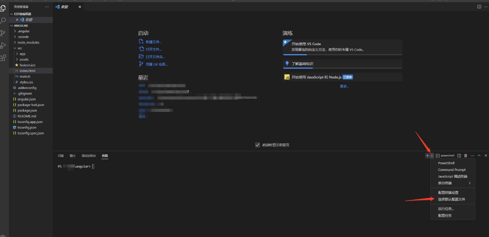
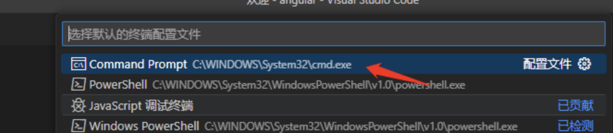
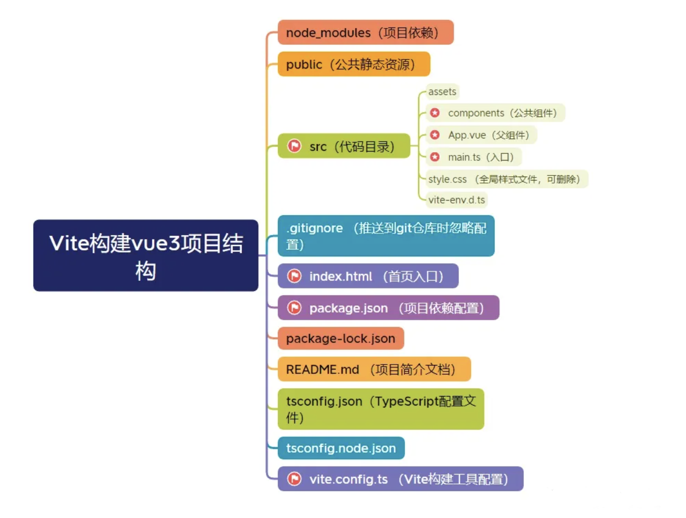
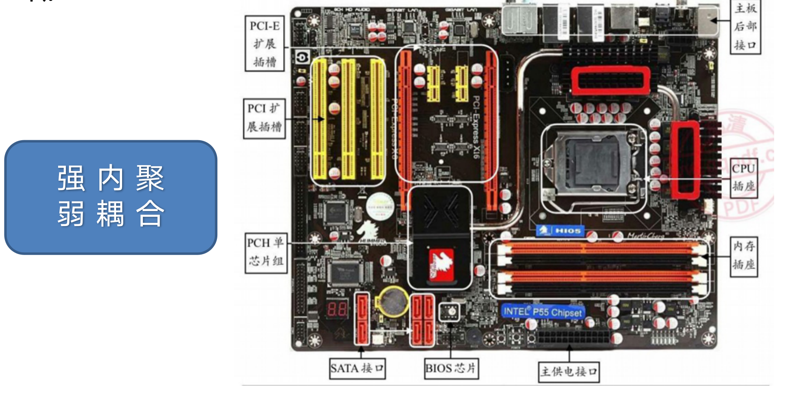
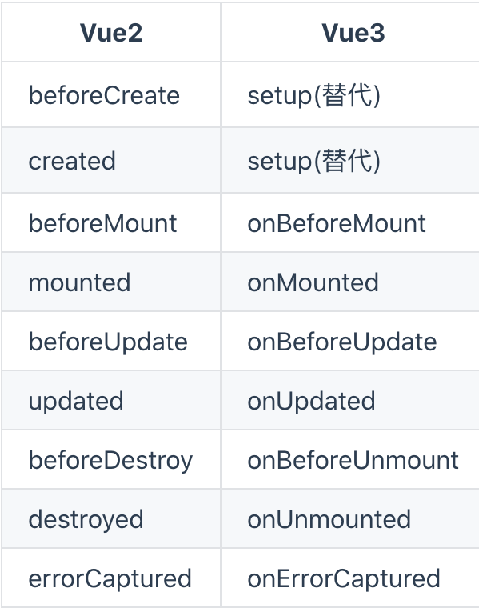
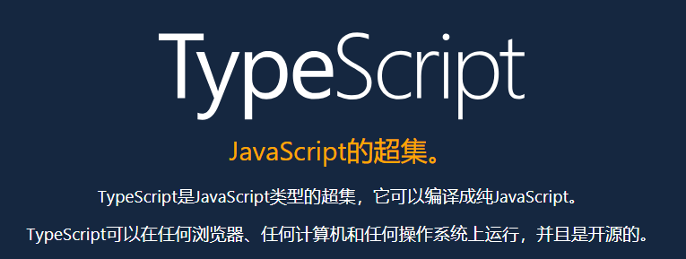

# 1. 课程目标

## 学习目标：

### 1. 掌握Vue3核心概念：
- 理解Vue3框架的核心概念和工作原理。
- 学习响应式数据、组件、指令等Vue3的基础知识。

### 2. 熟练应用Vue3新特性：
- 掌握Composition API，了解其灵活性和优势。
- 学习Teleport、Suspense等新功能，提升页面性能和用户体验。
- 利用Vue3对TypeScript(TS)的支持，提高代码的类型安全性。

### 3. 实战项目实践：
- 通过实际项目练习，巩固Vue3知识和技能。
- 学习Vue Router、Vuex等相关库的使用，实现复杂前端应用的构建。

## 学习Vue3的原因和优势：

### 1. 抢占前端技术先机：
- 学习Vue3意味着跟上前端技术发展趋势，保持竞争力。
- 掌握最新技术有助于提高解决问题的能力和效率。

### 2. 提升开发效率和质量：
- Vue3引入的新特性和改进能提升前端开发效率。
- 使用Composition API可以更好地组织代码，提高可维护性和可测试性。

### 3. 拓展职业发展空间：
- 精通Vue3可以拓展个人就业机会范围。
- 学习最新前端技术是职业发展的必经之路。

## 未来的提升所在

- 学习Vue3是持续学习和成长的重要一步，有助于保持在前端领域的竞争力。
- 熟练运用Vue3开发现代化项目，帮助你在职业道路上更进一步。

通过学习Vue3，你将更好地适应前端领域的变化，提升技能水平，扩展职业发展机会。祝你学有所成，前程似锦！


# 2. vue2和vue3的区别

1. **Composition(组合式) API vs Options(选项式) API**:
   - Vue3引入了Composition API，更灵活、易于组织代码，相较于Vue2的Options API更具优势。
2. **性能优化**:
   - Vue3在虚拟DOM和响应式系统方面进行了多项性能优化，提升了页面加载速度和渲染效率。
3. **TypeScript支持**:
   - Vue3更好地支持TypeScript，提供更好的类型检查和推断，有助于减少潜在错误。
4. **新增功能**:
   - Vue3引入了Teleport、Suspense等新功能，简化了处理复杂逻辑和异步操作的方式。
5. **树型组件优化**:
   - Vue3优化了树型组件的性能，特别是对于大型列表的渲染，表现更为出色。
6. **全局API调整**:
   - Vue3对全局API进行了调整和统一，使整个框架更加一致和易于理解。
7. **包大小优化**:
   - Vue3的包大小相较于Vue2有所减小，剔除了一些冗余代码，提升了整体性能。
8. **Tree-shaking效果**:
   - Vue3采用ES模块组织代码，优化了Tree-shaking的效果，减少了不必要的代码被打包到生产环境。
9. **更佳的响应式原理**:
   - Vue3重新设计了响应式系统，使变化侦测更加精确高效，提供更出色的性能表现。
10. **逻辑复用与共享**：
    -  Composition API让逻辑复用和共享更加便捷灵活，让代码组织更加清晰和高效。

# 3. vue 选项式与组合式区别

**当对比Composition API与Options API时，下面是它们的对比以及Composition API的优点和缺点：**

**1. 对比：**

1. 组织方式：Composition API以函数的形式组织代码，将相关逻辑聚合在一起，提高代码的可读性和可维护性；而Options API将数据、计算属性和方法等放置在同一个选项对象中，可能导致代码在不同选项中分散，降低可读性和可维护性。
2. 逻辑复用：Composition API更便于逻辑的复用和共享，通过函数的方式组织代码，使得在不同组件之间高效共享逻辑代码，提高代码重用性；而Options API相对而言，逻辑复用需要更多的手动努力和处理。
3. 类型推断：Composition API对于使用强类型语言（如TypeScript）的开发者更友好，具有更好的类型推断能力，可以发现潜在的类型错误，提高代码质量和稳定性；而Options API的类型推断能力相对较弱。

**2. Composition API的优点：**

1. 逻辑复用：Composition API使逻辑复用变得更加方便，可以更高效地在不同组件中共享代码。
2. 清晰的代码结构：通过根据逻辑关注点组织代码，Composition API可以获得更清晰、易于理解的代码结构，有助于团队协作和代码维护。
3. 更好的类型推断：Composition API在使用强类型语言时具有更好的类型推断能力，能够帮助开发者及早发现和避免潜在的类型错误。

**3. Composition API的缺点：**

1. 学习曲线较陡：对于已经熟悉Options API的开发者来说，适应和学习Composition API可能需要一定的时间和努力，因为它涉及到不同的用法和思维方式。
2. 开发者之间的转换成本：如果团队中的开发者之间在不同项目中频繁切换，从Options API转换到Composition API可能会带来额外的学习和适应成本。


**示例：**

假设我们有一个页面上的计数器需求，点击按钮时实现数量加一的功能。以下是使用Composition API和Options API实现同样功能的示例代码：

**Composition API示例：**
```vue
<template>
  <button @click="increment">Click to Increment: {{ count }}</button>
</template>

<script>
import { ref } from 'vue';

export default {
  setup() {
    const count = ref(0);
    
    const increment = () => {
      count.value++;
    };

    return {
      count,
      increment
    };
  }
};
</script>
```

**Options API示例：**
```vue
<template>
  <button @click="increment">Click to Increment: {{ count }}</button>
</template>

<script>
export default {
  data() {
    return {
      count: 0
    };
  },
  
  methods: {
    increment() {
      this.count++;
    }
  }
};
</script>
```

在以上示例中，可以看到Composition API将相关逻辑集中在一起，使得代码更易于理解和维护，而Options API则可能导致代码分散在不同选项中，降低了代码的清晰度和可读性。


# 4. vue3 项目的两种创建方式

原来咱们学习vue2的时候  使用的是vue/cli脚手架（实质上是帮助我们封装好了webpack来帮助我们构建与编译项目）

vue 的作者尤雨溪在开发 vue3.0的时候**开发的一个 web 开发构建工具**。其本人在后来对 vue3 的宣传中对自己的新作品 Vite 赞不绝口，并表示自己 ”再也回不去 webpack 了“ 。那么 Vite 究竟有什么魅力


注意windows的同学 在创建项目的时候把vscode的终端环境切换成cmd 以免权限导致下载出错(有时候会有权限问题)





然后重新重新打开终端即可 原来显示powershell的地方变为cmd


## 1. vue/cli

**使用Vue CLI创建Vue3项目的步骤：**

1. **全局安装Vue CLI：**
   
   - 打开命令行工具（如Terminal或Command Prompt）。

   - 运行以下命令安装Vue CLI：`cnpm install -g @vue/cli`。cnpm(淘宝路径下载)
    > 说明下,在把淘宝镜像进行全局设置后方可使用cnpm下载
    > cnpm是淘宝镜像下载第三方工具的指令
   
   - 如果npm 下载较慢可以选择使用淘宝镜像来进行下载 
   
     ```
     npm install -g cnpm --registry=https://registry.npmmirror.com
     ```
   
2. **创建新项目：**
   
   - 在命令行中运行`vue create project-name`，将`project-name`替换为你想要的项目名称。
   - 选择在创建过程中使用Vue3。
   
3. **选择配置选项：**
   
   - 在创建过程中，Vue CLI将提示选择预设配置或手动选择特性。选择Vue3作为Vue版本。
   - 可根据需求选择其他配置，如Babel、TypeScript等。
   
4. **切换路径：**
   
   - 项目创建完成后，进入项目目录：`cd project-name`。

5. **运行项目：**
   
   - 运行`npm run serve`启动开发服务器。
   - 访问`http://localhost:8080/`查看项目运行情况。

**注意事项：**

- 确保已安装Node.js和npm。
- 在创建项目时选择Vue3版本。
- 根据项目需求选择合适的配置选项，如TypeScript、CSS预处理器等。
- 定期更新Vue CLI版本，以使用最新功能和修复bug。


## 2. vite

**使用Vite创建Vue3项目的步骤：**

1. **全局安装Vite：**
   - 打开命令行工具。
   - 运行以下命令安装Vite：`cnpm install -g vite`。(cnpm淘宝路径下载)

2. **创建新项目：**
   - 在命令行中运行`npm init vite `。(mac的同学尽量使用npm 安装。否则可能电脑会因为权限不足报错)
   - 官网上为 `npm create vite@latest` 

3. **进入项目目录：**
   - 进入新创建的项目目录：`cd project-name`。

4. **安装依赖：**
   - 运行`npm install`安装项目依赖。

5. **运行项目：**
   - 运行`npm run dev`启动开发服务器。
   - 打开浏览器访问`http://localhost:3000/`查看项目。

**注意事项：**
- ==确保已安装Node.js和npm。==
- Vite是一个新型的构建工具，具有快速的冷启动和热更新功能。
- Vite不需要预先将代码编译成文件，因此启动更快，适用于现代化的前端开发。


## 3. 两种创建方式的区别

Vue CLI和Vite是用于创建Vue项目的两种工具，它们在底层实现和功能上有一些重要区别。

**Vue CLI：**

1. **底层实现：**
   - Vue CLI是基于Webpack构建工具实现的，通过Webpack打包和处理项目代码。
   - Vue CLI提供了项目配置、插件机制、预设选项等，可以灵活配置和定制项目。

2. **功能特点：**
   - Vue CLI支持多种预设选项，例如默认配置、手动配置、TypeScript等。
   - 提供了丰富的插件生态系统，例如Vuex、Vue Router等，可以扩展项目功能。

3. **开发体验：**
   - 在开发阶段，Vue CLI采用传统的模块化方式来处理依赖关系和热更新，速度相对较慢。

**Vite：(推荐)**

1. **底层实现：**
   - Vite是一种基于ES Module的构建工具，利用浏览器原生支持的ES Module特性，无需提前将代码编译成文件。
   - Vite采用现代化的构建方式，利用浏览器去解析import的依赖，实现更快的启动速度。

2. **功能特点：**
   - Vite基于Rollup构建工具，专注于快速开发和热更新，适用于快速原型开发和小型项目。
   - Vite内置支持Vue单文件组件以及快速的开发体验，无需预先编译文件，提供更加流畅的开发过程。

3. **开发体验：**
   - Vite在开发阶段采用HMR（热模块替换）和快速冷启动，实现了众多快速开发的特性，提供更好的开发体验。
   - 借助现代浏览器的ES Module特性，Vite可以实现快速热更新，加速开发过程。

# 5. 项目结构与HelloWord


- **==重要的是src目录==** 
  - index.html 入口页面 
  - package.json 项目依赖配置(==内含启动命令指令,可以自己改==)
  - vite.config.ts 项目工具配置
  - **components** 写vue代码的,放组件的
  - **App.vue** ==所有组件的老大,可以从components引入组件使用==
  - main.ts 引入一些东西的 import
  - style.css css样式
  - vite-env.d.ts 
  - public 公共静态资源文件,内部文件大伙都能用
  - **node_modules** 之前就见过了,内部放项目依赖(工具)
  >
- **components 下的vue文件标签组成 :**
  - script: Ts + js 代码区 (Ts向下兼容js)
  - template: html
  - style: css
- package.json : 命令定义文件,当年把node改为nodemon的地方



如果在引用组件的时候出现 vue3 无法找到模块“./xxxx/xxxx.vue”的声明文件 的错误 , 比如在App.vue中引入component组件.

在项目的 vite-env.d.ts文件中 追加下面的代码解决,让其能够识别.vue文件

```
// 报错原因：typescript 只能理解 .ts 文件，无法理解 .vue文件
declare module '*.vue' {
    import type { DefineComponent } from 'vue'
  
    const vueComponent: DefineComponent<{}, {}, any>
  
    export default vueComponent
  }
```


# 6.选项式api

## 响应式数据

选项式API创建响应式数据的方法

```html
<template>
  <div>
    <p>{{ message }}</p>
    <button @click="updateMessage">Update Message</button>
  </div>
</template>

<script>
export default {
  data() {
    return {
      message: 'Hello Vue!', // 创建响应式数据
    };
  },
  methods: {
    updateMessage() {
      this.message = 'Updated Message';
    },
  },
};
</script>

<style>
/* 样式 */
</style>
```

## 多事件处理器

事件处理程序中可以有多个方法，这些方法由逗号运算符分隔：

```
<script>
  export default {
    methods: {
      handleClick1($event, msg) {
        console.log(msg)
      },

      handleClick2() {
        console.log('click2')
      }
    }
  }
</script>

<template>
  <div>
    <button @click="handleClick1($event, 'click1'), handleClick2()">click</button>
  </div>
</template>

<style lang="css">
  
</style>
```


## 按键修饰符

- Vue2

在 Vue 2 中，`keyCodes` 可以作为修改 `v-on` 方法的一种方式。

```html
<!-- 键码版本 -->
<input v-on:keyup.13="submit" />

<!-- 别名版本 -->
<input v-on:keyup.enter="submit" />
```

此外，也可以通过全局的 `config.keyCodes` 选项定义自己的别名。

```js
Vue.config.keyCodes = {
  f1: 112
}
```

```html
<!-- 键码版本 -->
<input v-on:keyup.112="showHelpText" />

<!-- 自定义别名版本 -->
<input v-on:keyup.f1="showHelpText" />
```

- Vue3

从 [`KeyboardEvent.keyCode` 已被废弃](https://developer.mozilla.org/zh-CN/docs/Web/API/KeyboardEvent/keyCode)开始，Vue 3 继续支持这一点就不再有意义了。因此，现在建议对任何要用作修饰符的键使用 kebab-cased (短横线) 名称。

```html
<!-- Vue 3 在 v-on 上使用按键修饰符 -->
<input v-on:keyup.page-down="nextPage">

<!-- 同时匹配 q 和 Q -->
<input v-on:keypress.q="quit">
```

```vue
<script>
  export default {
    methods: {
      handleKeyup() {
        console.log('enter')
      },
      handleAKeyup() {
        console.log('a')
      },
      handleArrowKeyup() {
        console.log('arrow-up')
      }
    }
  }
</script>

<template>
  <div>
    <input type="text" @keyup.enter="handleKeyup">
    <input type="text" @keyup.a="handleAKeyup">
    <input type="text" @keyup.arrow-up="handleArrowKeyup">
  </div>
</template>

<style lang="css">
  
</style>
```

## 计算属性--computed

### 引子

````html

    
      <!-- 因为view区域是展示数据的  我们在这个里面处理数据 不合适 会导致页面的可读性比较差 -->
      <h1>基本展示:{{text}}</h1>
      <h1>大写：{{text.toUpperCase()}}</h1>
      <h1>大写截取：{{text.toUpperCase().slice(1,4)}}</h1>
    </div>
    <script>
        export default{
          
            data(){
              	return{
                  	 text:"abcdefghijk"
                }
               
            },
         
        }
       
    </script>

````

上面的代码没有问题但是后期可能会导致代码的可读性非常差

所以在我们**遇到了一条数据 在不同位置 展示出不同形态的时候  我们可以使用计算属性**

### 基本概念

在弄懂什么是计算属性之前 思考一个问题  什么是属性

**什么是计算属性？**

**就是把属性通过加工通过计算返回一个新的结果**那么这个就是计算属性


那么计算属性写在哪里  并且怎么写呢？

### 传统写法

写在与data methods 同级位置  使用 **computed** 

其中有两个方法 get与set

**get方法:必须要写**，该函数不接受参数,当初次读取计算属性或者计算属性所依赖的数据发生变化时被调用，getter函数有一个返回值，该返回值就是计算属性的值


```js
  computed:{
       计算出存储结果的名字:{
          //必须要写，该函数不接受参数
          //什么时候被调用?：当初次读取计算属性或者计算属性所依赖的数据发生变化时被调用，getter函数有一个返回值，该返回值就是计算属性的值
           get(){
              return 你的计算逻辑
           },
           //可选项 接受一个可选参数（计算属性被修改之后的值）
           //什么时候被调用?： 当计算属性被修改时被调用
            set(value){

            }
        }
    }
```

**读取**

````html

    <div id="demodiv">
       <h1>读取data中的数据--{{text}}</h1>
       <h1>读取计算属性的数据--{{newtext}}</h1>
    </div>
    <script>
        export default{
         
            data:{
                text:"abcdefghijk"
            },
            // 计算属性
            computed:{
                newtext:{
                    get(){
                        console.log("我是计算属性的get方法")
                        return this.text.toUpperCase()
                    }
                }
            }, 
        }
       
    </script>

````

**修改**

**set方法:可选项** 接受一个可选参数（计算属性被修改之后的值）**当计算属性的值**被修改时被调用

````html

    <div id="demodiv">
       
       <h1>读取data中的数据--{{text}}</h1>

       <input type="text" v-model="newtext">
       <h1>读取计算属性的数据--{{newtext}}</h1>
    </div>
    <script>
       export default{
          
            data:{
                text:"abcdefghijk"
            },
            // 计算属性
            computed:{
                newtext:{
                    get(){
                        console.log("我是计算属性的get方法")
                        return this.text.toUpperCase()
                    },
                    set(value){//当newtext被修改的时候set就会触发 value就是修改之后的数据
                        console.log("我是计算属性的set方法",value)
                    
                    }
                }
            }, 
        }
       
    </script>
</body>
</html>
````


### 简写写法推荐使用

通常我们的计算属性都是把计算出来的结果展示到页面上   set这种修改使用的非常少  所以在计算属性中也给我们提供了一种读取的简写语法

````js
computed:{
	你处理好的变量(){
		return 你的处理逻辑
	}

}
````

````vue

    <div id="demodiv">
       
       <h1>读取data中的数据--{{text}}</h1>


       <h1>读取计算属性的数据--{{newtext}}</h1>
    </div>
    <script>
        export default{
   
            data:{
                text:"abcdefghijk"
            },
            // 计算属性简写
            computed:{
                newtext(){
                    return this.text.toUpperCase()
                }
            }
        }
       
    </script>

````

### 计算属性是依赖data数据的

计算属性是依赖data里面的属性的   当计算属性依赖的data数据改变了  那么计算属性也会收到通知 做出相关的计算返回新的结果


### 计算属性与方法methods的区别

计算属性处理的数据 如果被多次调用的时候  计算属性只执行一次（因为计算属性在第一次处理好数据之后 就会把数据放到**缓存中**  之后的每次读取都是从缓存中读取的  所以 多次调用他只执行一次）总结一下就是计算属性是**依赖缓存的**


方法 他是一个憨憨   只要被调用就会执行   那么相对于计算属性依赖缓存而言   他更消耗性能


### 不支持异步

computed内有异步操作时无效，无法监听数据的变化，此时计算属性也是无效的。

## watch监听/侦听属性

watch是vue实例的一个属性  他的作用就是用来监听data中的数据   当数据变了watch就会触发  从而调用函数处理一些逻辑

### 简写写法

语法：写在与 data   methods  同级位置

```js
watch:{
	你要监听的data数据(newval,oldval){			

	}

}
```


```html

        <div id="demoDiv">
            <h1>watch</h1>
          
            <input type="text" v-model="text">
            <h1>{{text}}</h1>
        </div>

        <script>
            export default {
                el:"#demoDiv",
                data:{
                    text:""
                },
                methods:{

                },
                // watch监听数据
                watch:{
                    text(newval,oldval){
                        console.log(newval+"---"+oldval)
                    }
                }
            }
        </script>

```

#### watch在初始化能触发吗？

不会触发

#### 想再初始化触发watch怎么办？

watch 的一个特点是，最初绑定的时候是不会执行的，要等到 监听的数据 改变时才执行监听。那我们想要一开始就让他最初绑定的时候就执行改怎么办呢？

### watch 传统写法之属性与方法

#### handler方法  

data监听的数据改变触发的回调函数

```js
  //text变量改变的时候。handler方法就会触发
 watch:{
    text:{
      handler(newval,oldval){
           console.log("aaaa");
       },
    },     
  }
```

#### immediate属性

watch默认绑定，页面首次加载时，是不会执行的。只有值发生改变才会执行。

设置immediate为true后，监听会在被监听值初始化的时候就开始，也就页面上的数据还未变化的时候。

````js
 watch:{
    text:{
      handler(){
           console.log("aaaa");
       },
       immediate:true //true就表示会立即执行
    },
  }
````

#### deep 属性

属性 deep，默认值是 false，代表是否**深度监听**

**观察下面的代码**

当我们在在输入框中输入数据视图改变obj.name的值时，我们发现watch是无效的。


watch在监听对象的时候**受现代 JavaScript 的限制.  Vue 不能检测到对象属性的添加或删除。**


如果我们需要监听obj里的属性name的值呢？

```vue
<template>
  <div>
    <input type="text" v-model="obj.name">
    <h1>{{obj.name}}</h1>
  </div>
</template>

<script>
export default {
  data(){
    return {
      obj:{
        name:"xixi"
      }
    }
  },
  watch:{ 
    obj:{
      handler(){
           console.log("aaaa");
       },
       immediate:true //true就表示会立即执行
    },
     
  }
}
</script>

<style>

</style>
```

这时候deep属性 **深度监听**就派上用场了。

deep的意思就是深入观察，监听器会一层层的往下遍历，给对象的所有属性都加上这个监听器，**但是这样性能开销就会非常大了，任何修改obj里面任何一个属性都会触发这个监听器里的 handler。**

````vue
<template>
  <div>
    <input type="text" v-model="obj.name">
    <h1>{{obj.name}}</h1>
  </div>
</template>

<script>
export default {
  data(){
    return {
      obj:{
        name:"xixi"
      }
    }
  },
  watch:{

    obj:{
      handler(){
           console.log("aaaa");
       },
       immediate:true, //true就表示会立即执行
       deep:true
    },
     
  }
}
</script>

<style>

</style>
````


使用了deep之后  他会把对象中的**所有属性都监听到**不管你用不用  反正都会给你监听 **那么这样性能开销就会非常大了** 

#### deep优化

**优化，我们可以是使用字符串形式监听**

```vue
<template>
  <div>
    <input type="text" v-model="obj.name">
    <h1>{{obj.name}}</h1>
  </div>
</template>

<script>
export default {
  data(){
    return {
      obj:{
        name:"xixi"
      }
    }
  },
  watch:{
    // 字符串方式
    "obj.name":{
      handler(){
           console.log("aaaa");
       },
       immediate:true
    },
     
  }
}
</script>

<style>

</style>
```

## 自定义指令

在现有内置指令不够用的时候 我们可以自己定义指令来进行使用（由我们自己定义一个带有v-前缀的html特殊属性 扩展标签的功能）

### 自定义指令的钩子函数

bind   指令绑定到元素之上的时候执行 但是只执行一次

unbind 指令被移除的时候执行  只执行一次

update  所有组件节点更新的时候执行调用

componentUpdate 指令所在节点以及所有的子节点都更新完成的时候调用

**inserted 绑定指令的元素在页面展示的时候调用**


**注意：**

vue3自定义指令钩子

created：在绑定元素的 attribute 或事件监听器被应用之前调用。在指令需要附加在普通的 v-on 事件监听器调用前的事件监听器中时，这很有用。

beforeMount：当指令第一次绑定到元素并且在挂载父组件之前调用。

mounted：在绑定元素的父组件被挂载后调用，大部分自定义指令都写在这里。

beforeUpdate：在更新包含组件的 VNode 之前调用。

updated：在包含组件的 VNode 及其子组件的 VNode 更新后调用。

beforeUnmount：在卸载绑定元素的父组件之前调用

unmounted：当指令与元素解除绑定且父组件已卸载时，只调用一次。


```js
directives:{
	自定义指令的名字:{
		自定义指令的钩子函数（el代表的就是指定放在那个dom上形参就是谁）{
				你的逻辑
		}
	},
	自定义指令的名字2:{
	},

}
```

**使用   v-自定指令的名字**

````vue
<template>
  <div>
      <input type="text" v-xiaoming/>
  </div>
</template>

<script>
export default {
    // 创建
    directives:{
        xiaoming:{
            inserted(el){
                el.focus()
            }
        }
    }
}
</script>

<style>

</style>
````


# 7. Vue3 新特性函数 ---- setup 启动器/入口

1. setup函数(自己自动执行)是处于 生命周期函数 beforeCreate钩子之前被调用 也就说在 setup函数中是无法 使用 data 和 methods 中的数据和方法的

2. setup函数是 Composition API（组合API）的入口
3. ==**在setup函数中定义的变量和方法最后都是需要 return 出去的 不然无法再模板中使用**==

## setup 可以返回两种值：

### 返回对象

**1、返回对象，对象中的属性、方法都可以直接在模板中使用**

```vue

    <template>
        <div>
            <h1>年龄:{{text}}</h1>
            <button @click="fun">点我修改</button>
        </div>

    </template>
    <script>
        export default {
            setup(){
            let num=18
            let fun=()=>{
                num=20
                console.log(num)
                
            }
            // 必须要return出去
            return {num,fun}
        }

        }

        
    </script>
    <style></style>
```

### 返回渲染函数

**2、返回渲染函数，可以自定义渲染内容（其实也就是 render 函数）注意：渲染函数优先级还高，他会替换掉模板中的其他内容（用的比较少记住就好）**

```vue
    <template>
        <div>
           <h1>我是页面原始内容</h1>
        </div>

    </template>
    <script>
        export default {
            setup(){
            // 必须要return出去
            return ()=>"呵呵"
             }
        }
    </script>
    <style></style>
```

#### VUE3中h()函数和createVNode()函数的使用

**h()函数和createVNode()函数都是创建dom节点**，他们的作用是一样的，但是在VUE3中createVNode()函数的功能比h()函数要多且做了性能优化，渲染节点的速度也更快。

语法：

<h1 class="????" id="???">xxxxxxxxxxxxx</h1>

h(标签, {属性},内容)


```vue
<template>
  <div>

  </div>
</template>

<script>
// 1.要使用先引用
import {h} from "vue"
export default {
  setup() {
    return () => h('div',{class:"demodiv"}, ['Hello,Vue3'])
  }
}
</script>

<style>

</style>
```

h(标签, {属性},[可以继续嵌套h()])      

```
<div>
	<h1 class="???">xxxxxx</h1>
</div>
```


```vue
<template>
  <div class="demodiv">
		h1class="demoh" 
  </div>
</template>

<script>
// 1.要使用先引用
import {h} from "vue"
export default {
  setup() {
    return () => h('div',{class:"demodiv"}, [
      h("h1",{class:"demoh"},["我是标题标签"])
    ])
  }
}
</script>

<style>

</style>
```


createVNode(标签, {属性},[内容])

```vue
<template>
  <div>

  </div>
</template>

<script>
// 1.要使用先引用
import {createVNode} from "vue"
export default {
  setup() {
    return () => createVNode('div',{class:"demodiv"}, ['Hello,Vue3'])
  }
}
</script>

<style>

</style>
```


createVNode(标签, {属性},[可以继续嵌套createVNode()])

```vue
<template>
  <div>

  </div>
</template>

<script>
// 1.要使用先引用
import {createVNode} from "vue"
export default {
   setup() {
    return () => createVNode('div',{class:"demodiv"}, [
      createVNode("h1",{class:"demoh"},["我是标题标签"])
    ])
  }
}
</script>

<style>

</style>
```

## setup参数

使用setup函数时，它将接受两个参数：

- props
- context

### 参数1第一个参数props

props是一个对象，包含父组件传递给子组件的所有数据。

父组件

```vue
<template>
  <div>
    我是父组件
    <Zc title="我是正向传值的数据"/>
  </div>
</template>

<script>

import Zc from "../components/ZiCom.vue"
export default {
  components:{
    Zc
  },
  setup() {
    return {

    }
  },
}
</script>

<style>

</style>
```

子组件

```vue
<template>
  <div>
      我是子组件--{{title}}
  </div>
</template>

<script>


export default {
    props:["title"],//子组件设置props
    setup(props) {//setup第一个参数是props
        console.log(props)//如果想在setup中读取props数据必须设置第一个形参
        
        return {

        }
    },
}
</script>


<style>

</style>
```

为什么要使用setup的第一个形参props来接收父组件传递过来的数据？

之前在vue2中我们接受父组件传递过来的数据   都时使用props:[xxxxxxx,xxxxxx]这种定义方式

在vue3中只是给我们提供了更多的获取方式  大家不要想多了   给我们提供这个第一个形参来就收父组件传递过来的数据  只是为了更加方便我们在setup中使用父组件的传递数据  仅此而已   而不是必须要使用的


### 参数2第一个参数context

context是一个对象同时也是setup的第二个参数 里面包含了以下三个属性  attrs emit slots

#### attrs

**attrs 获取当前标签上面的所有属性的对象** （还是接受父组件传递过来的数据 ）


**注意** attrs是接收props没有声明的属性

**注意 **如果子组件用props已经声明   就不能使用attrs  否则会返回undefind


父组件

```vue
<template>
  <div>
    我是父组件
    <Zc title="我是正向传值的数据"/>
  </div>
</template>

<script>
import { defineComponent } from 'vue'
import Zc from "../components/ZiCom.vue"
export default defineComponent({
  components:{
    Zc
  },
  setup() {
    return {

    }
  },
})
</script>

<style>

</style>
```

子组件

```vue
<template>
  <div>
      我是子组件--{{title}}
  </div>
</template>

<script>
import { defineComponent } from 'vue'

export default defineComponent({
    // props:["title"],//如果使用attrs接收就不能声明props否则接收不到
    setup(props,context) {//setup第2个参数是context
        console.log(context.attrs)
        
        return {

        }
    },
})
</script>


<style>

</style>
```

总结：

setup第二个参数 attrs接收的就是父组件传递过来的数据 但是没有使用props接收的数据，如果子组件用props已经声明   就不能使用attrs  否则会返回undefind


什么时候用props来接收数据  什么时候使用context的attrs来接受数据

1.如果你接收来的数据想在页面展示的时候你使用props来接收（使用props接受的时候 必须定义props这个属性）

2.如果父组件传递过来的数据你不想在页面展示  只是想使用这个数据进行一些逻辑处理  那么你可以使用context.attrs来进行接受（如果想使用 不能定义props）

#### emit自定义事件

emit事件分发  用于子传父  如果子组件的数据想传递给父组件  就是用emit（逆向传值）

子组件

```vue
<template>
  <div>
      我是子组件
      <button @click="zifun">点我抛出事件</button>
  </div>
</template>

<script>


export default {
    setup(props,context) {
    //    子组件通过context的emit方法进行数据的抛出
       let zifun=()=>{
           context.emit("zipao",'我是子组件的数据')
       }
        
        return {//不要忘了return
            zifun
        }
    },
}
</script>


<style>

</style>
```

父组件

```vue
<template>
  <div>
    我是父组件
    <!-- 接收子组件的数据 注意不加()不加()-->
    <Zc @zipao="fufun"/>
  </div>
</template>

<script>

import Zc from "../components/ZiCom.vue"
export default {
  components:{
    Zc
  },
  setup() {
    let fufun=(val)=>{
      console.log("子组件的数据",val)
    }
    return {
      fufun
    }
  },
}
</script>

<style>

</style>
```

#### slots

插槽 带有dom的属性 （用来接收父组件传递的html内容）

子组件

```vue
<template>
  <div>
      我是子组件
      <!-- 定义槽口 -->
      <slot name="com"></slot>
      
  </div>
</template>

<script>


export default {
    setup(props,context) {
        
        console.log(context.slots)
        
        return {
        }
    },
}
</script>


<style>

</style>
```

父组件

```vue
<template>
  <div>
    我是父组件
 
    <Zc>
      
      <!-- 
        两个语法不能同时使用
        <template v-slot:com>
           <h1>我是插入的内容</h1>
        </template> 
      -->
      <template #com>
        <h1>我是插入的内容</h1>
      </template>
     
    </Zc>
  </div>
</template>

<script>
import { defineComponent } from 'vue'
import Zc from "../components/ZiCom.vue"
export default defineComponent({
  components:{
    Zc
  },
  setup() {
    
    return {
        
    }
  },
})
</script>

<style>

</style>
```

## 总结setup

setup是vue3中的CompositionAPI的启动器 他是会在beforecreate 与created之间去执行的   setup有2个形参  2种返回值

2个形参分别是  props和context  其中props就是接收父组件传递过来的属性   context其中包含的内容就比叫多了 他有三个属性  attrs emit slots   

attrs获取当前标签上面的所有属性的对象 但是不能和props属性连用 如果连用了 那么会返回什么都没有

emit自定义事件

slots 插槽 带有dom的属性 （用来接收父组件传递的html内容）


2中返回值   分别是  对象 和 返回渲染函数      

对象 就是要把定义在setup中的属性与方法必须返回出去 要不然模板不能使用


渲染函数  返回渲染函数的优先级比 写在模板中的内容优先级高 所以写了渲染函数 会覆盖原有的模板内容   如果要返回渲染函数  还要配合vue中提供的  h函数 或者是createVNode函数   createVNode()函数的功能比h()函数要多且做了性能优化，渲染节点的速度也更快。


# 8. 新语法


Setup新方式3.2：它相对于之前vue3的写法 进行了语法升的升级 可以理解为是之前语法的 语法糖（全称 糖衣语法  他其实就是用简单的语法来描述之前复杂的写法）

- 不需要return任何东西，所有定义的变量和方法会自动导出，template模板可以直接使用

- import引入的组件也会自动导出，模板里可以直接引用。

- 引入的组件命名需要首字母大写。

- 确切的说是：**所有的变量方法和import导入都可以在模板中直接使用**。

  ```html
  <script setup>
    
  
  
  </script>
  ```

# 9. 组件化

## 组件的概念

组件就是把ui部分拆分成一个个独立的并且可以重复使用的部件  在吧这些部件拼装在一起 形成一个页面

**组件的设计目的是提高代码复用率，降低测试难度和代码的复杂程度。**

1. 提高代码复用率：组件将数据和逻辑进行封装。
2. 降低测试难度：组件高内聚低耦合（各个元素高集成度低关联性），很容易对单个组件进行测试。
3. 代码的复杂程度：直观的语法，可以极大提高可读性。




### 全局组件---component

1.在main.js中引用所需要的组件

2.使用component调用

3.在任意组件可以直接使用

```js
import { createApp } from 'vue'
import App from './App.vue'
import router from './router'
import store from './store'
// 1.引用
import SunView from "./components/SunView.vue";
// 2.使用component调用


createApp(App).component('SunView',SunView).use(store).use(router).mount('#app')


```

### 局部组件

- import引入的组件也会自动导出，模板里可以直接使用。

- 引入的组件命名需要首字母大写。

  

```vue
<template>
  <div>
    <!--2使用-->
    <ZiView/>
  </div>
</template>

<script setup>
// 1.要使用先引用
import ZiView from "@/components/ZiView.vue"

</script>

<style>

</style>
```


# 10. CompositionAPI

“*响应式*”,*是指当数据改变后,Vue 会通知到使用该数据的代码*。例如,视图渲染中使用了数据,数据改变后,视图也会自动更新。

## 组合式api CompositionAPI----ref

**ref( )** 接受一个内部值，返回一个ref 对象，这个对象是响应式的、可更改的，且只有一个指向其内部值的属性 .value。

注意：

1. 响应式数据：使用"ref"创建的数据是响应式的，这意味着当数据发生变化时，Vue.js会自动检测到并更新使用该数据的相关组件。

2. 创建基本数据类型：使用"ref"创建基本数据类型时，它会返回一个包装对象，该对象包含一个"value"属性，用于存储实际的数据。可以通过读取和修改"value"属性来操作数据。

3. 创建复杂数据类型：使用"ref"创建复杂数据类型时，它底层会使用其他机制来进行处理，包括创建一个响应式的对象或数组。实际上，Vue.js内部可能会使用其他函数，如"reactive"来实现对复杂数据类型的响应式处理。

4. 底层操作：Vue.js的响应式系统使用了底层的"Proxy"对象和"Reflect"对象来实现数据的劫持和观察。当使用"ref"创建数据时，Vue.js会将该数据转换为可代理的响应式对象。这样，当数据被访问或修改时，Vue.js可以捕捉到相应的操作并触发更新。


### ref创建数据

````vue
<template>
  <div>
    <h2>姓名：{{ name }}</h2>
    <h2>年龄：{{ age }}</h2>
    <h3>工作种类：{{ job.type }}</h3>
    <h3>工作薪水：{{ job.salary }}</h3>
      
  </div>
</template>

<script setup>
// 数据-ref可以处理基本数据类型，也可以处理对象/数组数据类型的数据
let name = ref("张三");
let age = ref(18);
// ref在处理对象或数组时，底层都是通过reactive处理后，处理成了Proxy代理实例对象
let job = ref({
  type: "前端工程师",
  salary: "30K",
});
  
</script>

<style>

</style>
````

**要是想改变 ref 的值 必须改变它里面有个属性 value**

```vue
<template>
  <div>
   <h2>姓名：{{ name }}</h2>
	<h2>年龄：{{ age }}</h2>
	<h3>工作种类：{{ job.type }}</h3>
	<h3>工作薪水：{{ job.salary }}</h3>
	<button @click="fun">修改人的信息</button>
  </div>
</template>


<script setup>
// 数据-ref可以处理基本数据类型，也可以处理对象/数组数据类型的数据
let name = ref("张三");
let age = ref(18);
// ref在处理对象或数组时，底层都是通过reactive处理后，处理成了Proxy代理实例对象
let job = ref({
  type: "前端工程师",
  salary: "30K",
});
  
  
  	function changeInfo() {
			// 修改基本数据类型
			name.value = '李四'
			age.value = 48
			// 修改对象数据类型
			
			job.value.type = 'UI设计师'
			job.value.salary = '60K'
	
		}
</script>

<style>
</style>
```

**通常很多人都这样说  ref是创建基本数据类型  但是这种描述是不对的 准确说 ref既可以创建基本数据类型也可以创建复杂数据类型**

**但是他在创建复杂数据类型的时候底层使用的是另外一个函数 叫做reactive**

### 获取dom的ref

```vue
<template>
  <div>
    <!-- 2.绑定 -->
      <h1 ref="demoh">我是一个dom</h1>
      <button @click="fun()">点我获取</button>
  </div>
</template>


<script setup>
import { ref } from "vue";
// 1.创建
let demoh = ref();
let fun = () => {
  // 3使用 这个.value是ref获取数据的时候必要的
  console.log(demoh.value)
};
</script>

<style>
</style>
```


## 组合式api CompositionAPI----reactive函数

-  定义一个**对象类型**的响应式数据
- 语法：`const 代理对象= reactive(源对象)`接收一个对象（或数组），返回一个**代理对象（Proxy的实例对象，简称proxy对象）**
- reactive定义的响应式数据是“深层次的”，多少层级都可以设置

```vue
<template>
  <div>
   <h2>姓名：{{ person.name }}</h2>
	<h2>年龄：{{ person.age }}</h2>
	<h3>工作种类：{{ person.job.type }}</h3>
	<h3>工作薪水：{{ person.job.salary }}</h3>
	<h3>爱好：{{ person.hobby }}</h3>
	<h3>测试的数据c：{{ person.job.a.b.c }}</h3>
  </div>
</template>


<script setup>
import { reactive } from "vue";

//数据
		let person = reactive({
			name: '张三',
			age: 18,
			job: {
				type: '前端工程师',
				salary: '30K',
				a: {
					b: {
						c: 666
					}
				}
			},
			hobby: ['抽烟', '喝酒', '烫头']
		})
</script>

<style>
</style>
```

**修改数据**

使用reactive创建的数据 修改的时候直接修改 不需要.value 不需要.value 不需要.value 不需要.value 不需要.value


### ref和reactive区别

- 从定义数据角度对比：
  - ref用来定义：**基本类型数据**。
  - reactive用来定义：**对象（或数组）类型数据**。
  - 备注：ref也可以用来定义**对象（或数组）类型数据**, 它内部会自动通过`reactive`转为**代理对象**。
- 从原理角度对比：
  - ref通过`Object.defineProperty()`的`get`与`set`来实现响应式（数据劫持）。
  - reactive通过使用**Proxy**来实现响应式（数据劫持）, 并通过**Reflect**操作**源对象**内部的数据。
- 从使用角度对比：
  - ref定义的数据：操作数据**需要**`.value`，读取数据时模板中直接读取**不需要**`.value`。
  - reactive定义的数据：操作数据与读取数据：**均不需要**`.value`。

## 组合式api CompositionAPI----计算属性computed

**概念：**

1. 计算属性（computed）是一种模板中使用的属性，它的值是根据其他响应式数据（如data属性、其他计算属性等）计算得出的。
2. 计算属性可以用于在模板中展示数据、进行数据的派生计算等。
3. 计算属性是惰性的，只有在它所依赖的响应式数据发生改变时才会重新计算。

**注意点：**

1. 计算属性的性能优化：根据计算属性的依赖，Vue.js会自动进行缓存，只有在依赖的数据变化时才会重新计算计算属性的值。这也意味着你无需担心频繁访问计算属性的性能问题。

2. 计算属性的响应式依赖：请确保在计算属性中只使用响应式数据作为依赖，避免使用普通的JavaScript变量或函数等。这样可以确保计算属性能够正确追踪数据变化并更新。

3. 计算属性与方法的对比：你也可以使用方法（methods）来实现计算属性的功能。不过相比于方法，计算属性具有自动缓存和依赖追踪的优势，更适合进行派生计算。


### 简写使用

````vue
<template>
  <div>
    <input type="text" v-model="data" />
    <h1>默认的：{{ data }}</h1>
    <h1>变大写的：{{ newdata }}</h1>
    <h1>合并的：{{newperson}}</h1>
  </div>
</template>

<script setup>
import { ref, computed, reactive } from "vue";
let data = ref("abcdefg");

let person = reactive({
  firstName: "张",
  lastName: "三",
});
 

// 计算属性
let newdata = computed(() => {
  return data.value.toUpperCase();
});

let newperson = computed(() => {
  return  person.firstName + " " + person.lastName;
});
</script>

<style>
</style>
````

### 完整写法

传入一个拥有 `get` 和 `set` 函数的对象，创建一个可手动修改的计算状态。

```vue
<template>
  <div>
    <input type="text" v-model.number="data" />
    <h1>默认的：{{ data }}</h1>
    <h1>处理好的{{ newdata }}</h1>


    <input type="text" v-model="newdata">

  </div>
</template>

<script setup>
import { ref, computed } from "vue";
let data = ref(2);

const newdata = computed({
  // 必填
  get: () => data.value + 1,
  // 可选 当你把计算属性处理好的数据修改的时候set触发
  set: (val) => {
   console.log("计算属性处理的数据呗修改了",val)
  },
})
</script>

<style>
</style>
```


## 组合式api CompositionAPI----watch监听

侦听一个或多个**响应式数据的变化**，数据变化时执行回调函数

### 监听单个数据

```vue
<template>
  <div>
    <input type="text" v-model="data" />
    <h1>{{ data }}</h1>
  </div>
</template>

<script setup>
import { ref, watch } from "vue";
let data = ref("abcdefg");
// 第一个参数是你要监听的数据
// 第二个参数是数据改变之后触发的函数
watch(data, (newVal, oldVal) => {
  console.log("newVal", newVal);
  console.log("oldVal", oldVal);
});
</script>

<style>
</style>
```

### 监听多个数据

如果有的时候 我们想监听多个变量 当这些变量改变了 触发相同的回调

将需要监听的数据添加到数组

```vue
<template>
  <div>
    <input type="text" v-model="data" />
    <h1>{{ data }}</h1>
    <input type="text" v-model="datab" />
    <h1>{{ datab }}</h1>
  </div>
</template>

<script setup>
import { ref, watch } from "vue";
let data = ref("第1个数据");
let datab = ref("第2个数据");
// 第一个参数是你要监听的数据多个数据使用数组来表示
// 第二个参数是数据改变之后触发的函数
watch([data,datab], (newVal, oldVal) => {
  console.log("newVal", newVal);
  console.log("oldVal", oldVal);
});
</script>

<style>
</style>
```

### watch监听整个对象

在vue2中watch默认是无法监听到对象中的属性 必须手动开启deep深度监听

在vue3中**默认开启deep深度监听**（**但是注意如果使用默认的watch语法当 监听值为响应式对象时，oldValue值将出现异常，此时与newValue相同**）

**当监听整个对象时，只要这个对象有任何修改，那么就会触发 watch 方法。无论是其子属性变更 还是孙属性变更都是会触发 watch 方法的。**

观察下面得代码会发现 newval和oldval的值是一样的

```vue
<template>
  <div>
    <input type="text" v-model="obj.name" />
    <h1>{{ obj.name }}</h1>
  </div>
</template>

<script setup>
// 监听对象
// 在watch监听对象的时候vue3中会开启强制deep深度监听


import { reactive, watch } from "vue";
  let obj=reactive({
    name:"xixi",
    age:18
  })
// 第一个参数是你要监听的数据多个数据使用数组来表示
// 第二个参数是数据改变之后触发的函数
watch(obj, (newVal, oldVal) => {
  console.log("newVal", newVal);
  console.log("oldVal", oldVal);
});
</script>

<style>
</style>
```

**监听对象属性**

在监听对象的时候我们可以把第一个参数设置成函数并且返回你要监听的数据 这样new和oldval正常了

```vue
<template>
  <div>
    <input type="text" v-model="obj.name" />
    <h1>{{ obj.name }}</h1>
  </div>
</template>

<script setup>


import { reactive, watch } from "vue";
  let obj=reactive({
    name:"xixi",
    age:18
  })
// 在监听对象的时候我们可以把第一个参数设置成函数并且返回你要监听的数据
watch(()=>{return obj.name}, (newVal, oldVal) => {
  console.log("newVal", newVal);
  console.log("oldVal", oldVal);
});
</script>

<style>
</style>
```

**监听多个对象属性**

监听多个对象属性的时候使用数组来进行设置

```vue
<template>
  <div>
    <input type="text" v-model="obj.name" />
    <input type="text" v-model="obj.age" />
    <h1>{{ obj.name }}</h1>
    <h1>{{ obj.age }}</h1>
  </div>
</template>

<script setup>


import { reactive, watch } from "vue";
  let obj=reactive({
    name:"xixi",
    age:18
  })
// 监听多个对象属性的时候使用数组来进行设置
watch([()=>{return obj.name},()=>{return obj.age}], (newVal, oldVal) => {
  console.log("newVal", newVal);
  console.log("oldVal", oldVal);
});
</script>

<style>
</style>
```


#### 手动开启deep深度监听

如果你监听的复杂数据类型里面是一层那么就可以使用默认的deep  但是如果你监听的复杂类型是多层就要手动开deep深度监听

**当监听响应式对象的属性为复杂数据类型时，需要开启deep深度监听**

**当监听proxy对象的属性为复杂数据类型时，需要开启deep深度监听**

**当监听proxy对象的属性为复杂数据类型时，需要开启deep深度监听**


比如下面得数据 我们监听obj下的user vue3也没有办法了 

```js
let obj = reactive({
 
  user: {
    name: "xixi",
    age: 18,
    
  },
});
```

````vue
<template>
  <div>
    <input type="text" v-model="obj.user.name" />
    <input type="text" v-model="obj.user.age" />
    <h1>{{ obj.user.name }}</h1>
    <h1>{{ obj.user.age }}</h1>
  </div>
</template>


<script setup>
import { reactive, watch } from "vue";
let obj = reactive({
  user: {
    name: "xixi",
    age: 18,
  },
});
// 监听多个对象属性的时候使用数组来进行设置
watch(
  () => {return obj.user},
  (newVal, oldVal) => {
    console.log("newVal", newVal);
    console.log("oldVal", oldVal);
  },
  // 第三个参数就是设置deep
  {
    deep:true
  }
);
</script>

<style>
</style>
````

但是newval和oldval还是有问题   但是数据修改函数可以触发


### watch总结

vue3中的watch作用和vue2是一样的都是对数据进行监听当数据改变的时候watch就会知道从而执行一个异步操作

在vue3中组合式api的watch他在监听基本类型和复杂类型的时候语法有所不同

  在监听基本类型的时候watch的第一个参数就是你要监听的内容  第二个参数就是监听内容改变之后触发的函数 如果又多个监听项需要使用数组来容纳多个监听内容

 在监听复杂类型的时候  vue3watch默认是开启deep的  如果直接监听复杂数据  可能会出现 数据改变了  但是监听函数中的newval和oldval相同的问题    解决方式就是在监听的时候把第一个参数变成一个函数return 我们要监听的内容  即可解决

但是在监听数据的时候 如果监听的数据是对象的属性也是复杂类型那么默认deep就不行了  我们必须在watch上设置第三个参数 是一个对象 写入deep为true开启深度监听


## 组合式api CompositionAPI----watchEffect

watchEffect也是监听数据，但是它会立即运行一个函数，而不是懒侦听。

如果需要页面加载完毕立即执行的话，还是用watchEffect

**watchEffect 它与 watch 的区别主要有以下几点：**

1. 不需要手动传入依赖
2. 每次初始化时会执行一次回调函数来自动获取依赖
3. 无法获取到原值，只能得到变化后的值
4. `watch` 是惰性的，因此仅当依赖项更改时才会触发。`watchEffect` 在创建组件后立即运行，然后跟踪依赖关系。

````vue
<template>
  <div>
    <h1>{{text}}---{{textb}}</h1>
    <button @click="fun()">点我修改</button>
  </div>
</template>

<script setup>
import {ref, watchEffect} from "vue"
  let text=ref("你好")
  let textb=ref("你真好")
  watchEffect(()=>{
    console.log(text.value);
    // console.log(textb.value);
  
  })


  let fun=()=>{
    text.value="你坏"
    textb.value="你真坏"
  }
</script>

<style>

</style>
````

## 过滤器

vue中 在vue1x中过滤器有内置过滤器和自定义过滤器   但是到了2x中取消了内置过滤器  **在3x中啥都没有了**

**vue3取消了vue2中的自定义过滤器**，但是变相一下，在vue3中可以把数据当成函数的实参传递给一个函数  这样一来就可以使用一个函数来模拟原来的vue2过滤器

比如我们要过滤下 一个数据

```vue
<template>
  <div>
    <h1>正常展示:{{data}}</h1>
    <!-- 创建一个函数模拟过滤器 -->
    <h1>只显示年:{{setdata(data)}}</h1>

  </div>
</template>

<script setup>
import {ref} from "vue"

let data=ref("2022-10-1")

let setdata=(val)=>{
  return val.substr(0,4)
}
</script>

<style>

</style>
```

## 组件生命周期钩子函数

vue实例从创建到销毁的过程中被自动执行的函数

### 作用

就是给程序提供一个自动执行逻辑的场所



```vue
<template>
  <div>
  
  </div>
</template>

<script setup>
import {
  onBeforeMount,
  onMounted,
  onBeforeUpdate,
  onUpdated,
  onBeforeUnmount,
  onUnmounted,
} from "vue";
// 其他的生命周期
onBeforeMount(() => {
  console.log("App ===> 相当于 vue2.x 中 beforeMount");
});
onMounted(() => {
  console.log("App ===> 相当于 vue2.x 中 mounted");
});

// 注意，onBeforeUpdate 和 onUpdated 里面不要修改值
onBeforeUpdate(() => {
  console.log("App ===> 相当于 vue2.x 中 beforeUpdate");
});

onUpdated(() => {
  console.log("App ===> 相当于 vue2.x 中 updated");
});

onBeforeUnmount(() => {
  console.log("App ===> 相当于 vue2.x 中 beforeDestroy");
});

onUnmounted(() => {
  console.log("App ===> 相当于 vue2.x 中 destroyed");
});
</script>

<style>
</style>
```


# 11.前后台交互

## 什么是前台什么是后台    什么是前端什么是后端？

前端指的是数据展示

后端指的是数据处理

## 分类

## fetch VS axios VS ajax区别

1.传统的ajax 就是值使用XMLHttpRequest方法实现的数据请求   他隶属于原生的js  核心就是XMLHttpRequest对象  如果多个请求有先后顺序的话  那么容易造成回调地狱问题

jqueryajax  就是对原生XMLHttpRequest封装


2.axios 是基于promise封装的  本质上还是XMLHttpRequest的封装 只不过他是基于最新的语法进行封装的


3.fetch 就是原生js最新标准  和XMLHttpRequest没有半点关系


### axios

axios 是目前最优秀的 HTTP 请求库之一，虽然 axios 已经封装的非常好了，我们可以直接拿过来用。但是在实际的项目中，我们可能还需要对 axios 在封装一下，以便我们更好的管理项目和各个接口。

axios 也是对XHR对象进行封装  当时它是使用符合当下的promise来进行的封装

(1)下载  cnpm install --save axios

(2)引用  

````
// 引用axios
import axios from "axios"
````


### axios常见api


#### axios.request

该方法是axios项目的核心处理方法，实现用户自定义配置、应用拦截器、发送请求核心功能

#### axios其他api

就是发送相关请求  比如get请求  delete请求等

##### get方式--params发送参数

```js
    //   axios.get("请求地址",{params:{发送数据key:发送的val}}).then((ok)=>{
    //     // 成功回调
    //   }).catch((err)=>{
    //     // 失败回调
    //   })
      axios.get("/api/userlist/get",{params:{name:"xixi"}}).then((ok)=>{
        console.log(ok)
      }).catch((err)=>{
        console.log(err)
      })
    }
    
    axios({
      url:"xxxx",
      method:"GET",
      params:{xxx:xxxx}
    })
    
 
```

##### post方式--data发送参数

```js
		//   axios.post("请求地址",{data:{发送的key:发送的val}}).then((ok)=>{
    //     // 成功回调
    //   }).catch((err)=>{
    //     // 失败回调
    //   })
      axios.post("/api/userlist/post",{data:{name:"xixi"}}).then((ok)=>{
        console.log(ok)
      }).catch((err)=>{
        console.log(err)
      })
```

**但是大家会发现后台接收不到我们发送的数据**

原因是因为：

在发送post的时候Content-type（**表示请求和响应中的媒体类型信息。它用来告诉服务端如何处理请求的数据，以及告诉客户端（一般是浏览器）如何解析响应的数据**）常见有三种形式:

- Content-Type: **application/json**  就是给后台的数据是一个json对象
- Content-Type: **application/x-www-form-urlencoded** 表单数据编码为键值对，&分隔 如：name=java&age = 23
- Content-Type: **multipart/form-data** 通常文件上传

现在最主流的是**application/json**形式**axios默认就是这种方式** 就像上面我们写的post代码  直接把后该要的参数放到data中就可以了


如图可以发现我们的请求方式

但是有时候后端要求Content-Type必须以application/x-www-form-urlencoded形式，那么通过上面application/json传递的参数，后端是收不到的，我们必须对参数数据进行所谓的**序列化**处理才行，让它以普通表单形式(键值对)发送到后端，而不是json形式

###### 用qs模块来序列化参数

我们也能通过第三方依赖来序列化参数，就更加方便简洁，下载qs模块。

1.下载  npm install --save qs

2.引用 import qs from “qs”

3.在传递数据的时候使用qs序列化

```
  let key=qs.stringify({
              key:val
  })

```


```jsx
	// 引用qs
	import qs from 'qs';

    // 序列化数据
    let key=qs.stringify({
        name:"xixi"
    })
        // 传递
      axios.post("/api/userlist/post",key).then((ok)=>{
        console.log(ok)
      }).catch((err)=>{
        console.log(err)
      })
    }
    


```


##### delete put 等方式

delete 同get

```jsx
 axios.delete("/api/userlist/delete",{params:{name:"xixi"}}).then((ok)=>{
        console.log(ok)
      }).catch((err)=>{
        console.log(err)
      })
```

put方式 同post

```jsx
import axios from "axios"
// 引用qs
import qs from 'qs';

    // 序列化数据
    let key=qs.stringify({
        name:"xixi"
    })
        // 传递
      axios.put("/api/userlist/put",key).then((ok)=>{
        console.log(ok)
      }).catch((err)=>{
        console.log(err)
      })
    }
    


```

## 跨域

因为浏览器的安全机制 同源策略   不同端口不同域名不同协议  就会造成跨域

工作中 通常  开发阶段前端解决   上线阶段 后端解决

### jsonp   

动态创建一个script标签 通过src属性进行数据获取

### 代理跨域

代理：**造成跨域的问题是浏览器的安全机制**  因为有了这个安全机制我们才要解决跨域  

​            我现在不让浏览器帮我发送请求了 而是让我项目的服务器帮助我绕开浏览器发送请求

#### nginx反向代理

#### devServer代理跨域

就是传统请求  我们是让浏览器帮助我们去请求数据   那么我们就要遵循浏览器的同源策略  但是

**我们在vue或者是今后学的react中   有一个东西叫devServer他就是一个开发时候的一个微型小服务器   那么我们可以让他代理我们去发送请求  那么这样一来就不经过浏览器了  没有经过浏览器 那么就没有同源策略  没有同源策略就没有跨域  从而就解决了跨域**

devServer就是vue脚手架中那个内置的微型开发小服务器--注意    **上线之后 该种方式就会失效**

1.找到项目的根路径下 vite.config.ts

2.写入如下内容

````
import { defineConfig } from 'vite'
import vue from '@vitejs/plugin-vue'

// https://vitejs.dev/config/
export default defineConfig({
  plugins: [vue()],

  server:{
    proxy:{
     // 将所有以'/api'开头的请求转发到'http://localhost:8888/'
      '/api': {
        target: 'http://localhost:8888/',  //需要解决跨域的地址
         // 对请求路径进行重写，去掉开头的'/api'部分
        rewrite: (path) => path.replace(/^\/api/, '')
      }
    }
  }
})


````

3.修改请求路径

````vue
<template>
  <div>
      <h1>大纲要修写法</h1>
        <button @click="fun()">点我请求数据</button>
  </div>
</template>

<script>
import $http from "axios"
export default {
    methods:{
        fun(){
           $http({
            //    修改名字
               url:"/api/data/cityinfo/101320101.html",
               method:"get",//没有s
           }).then((ok)=>{
               console.log(ok)
           }).catch((err)=>{
               console.log(err)
           })
        }
    }
}
</script>

<style>

</style>
````

4.千万不要忘了重启

### cors

后端解决跨域----在工作的时候  **后端解决跨域  大概率都是在项目上线的时候 才会解决**

## json-server模拟数据

json-server就是为我们创建模拟数据的一个技术  因为在开发的时候 我们不可能写一个功能之前后端都给我们把对应的接口写好 所以有的时候我们需要有模拟数据  来给我们提供页面展示内容

1.安装

````
npm i -g json-server 
````

2.在项目中新建一个mock文件夹   并且创建json文件用来容纳模拟数据文件

3.cd到mock文件夹下   json-server --watch xxx.json --port 端口号

扩展:  修改启动命令   

去package.json 找到scriptc节点添加我们的json-server的启动命令别名

````json
  "scripts": {
    "serve": "vue-cli-service serve",
    下面就是
    "niubi":"json-server --watch ./src/mock/data.json --port 8899",
    上面就是
    "build": "vue-cli-service build",
    "lint": "vue-cli-service lint"
  },
````

### 增删改查

```js
  // - 查询所有
     axios({
          method:"get",
          url:"http://localhost:3000/data",
      }).then((data)=>{
         console.log(data)
       )
 
 
      // - 查询单个
     axios({
          method:"get",
          url:"http://localhost:3000/data/3",
       }).then((data)=>{
         console.log(data)
       })
 
 		//根据给定的name查找
     axios({
          method:"get",
          url:"http://localhost:3000/data?username=小猴",
      }).then((data)=>{
         console.log(data)
      })
		
 
      // - 添加操作
          axios({
            method:"post",
            url:"http://localhost:3000/data",
            data:{
              username:"Yi只猴",
              age:18
            }
          }).then((data)=>{
            console.log(data)
        })
 
 
 
      // - 删除操作
      axios({
         method:'delete',
         url:'http://localhost:3000/data/1'//直接写ID即可
       }).then((data)=>{
         console.log(data)
       })
 
 
 
      // - 修改操作
     axios({
        method:"patch/put",
        url:"http://localhost:3000/data/3",//ID
        data:{
          username:'嘻嘻' //要修改成什么
        }
     }).then((data)=>{
       console.log(data)
     })
 
     

```


## axios封装

在大型项目中 http请求会有很多 而且我们需要区分 所以我们可以把数据请求拆分出来 单独管理这样一来 就可以增强项目的可**维护性与可扩展性**

大体分为如下内容

1. api 请求集中式管理(当前这一步其实在工作中遇到的概率大于90%  但是在此过冲中需要掌握流程而不是语法)
2. 实现请求拦截
3. 实现响应拦截
4. 常见错误信息处理（对返回的http状态码进行判断）
5. 请求头设置

### api请求集中管理

1.初始化axios实例  编写util文件夹（工具文件夹 里面用来放一些没有也无所谓 但是有类了可以简化我们项目的一些内容） 在编写index.js来容纳封装内容

> 虽然axios中已经给我们封装好了一些常见的api如上面的axios.get axios.post等
>
> 但是我们为了更好的全局控制所有请求的相关配置，所以我们使用 axios.create()创建实例的方法来进行相关配置，这也是封装 axios 的精髓所在。
>
> 通过 create() 方法我们得到了一个 axios 的实例，该实例上有很多方法，比如拦截器等等。我们创建实例的时候可以配置一些基础设置，比如基础请求地址，请求超时等等。

```js
  import axios from "axios"
  // 创建 axios 请求实例
  const serviceAxios = axios.create({
      baseURL: "", // 基础请求地址
      timeout: 10000, // 请求超时设置
  });
  export default serviceAxios
```

2.新建api文件夹 并且编写js文件用来容纳 **api请求集中管理**

```js
import request from "../util/index.js"

export let funget=()=>{
    return request({
        url:"/api/userlist/get",
        method:"GET",
        params:{
            name:"xixi"
        }
    })
}
```

3.在组件中进行使用我们封装的 **api请求集中管理**

```jsx
		// 引用
		import {funget} from "../api/index.js"


        // 使用
        funget().then((ok)=>{
            console.log(ok)
        })
    }


```

我们就简单的划分出 `API` 管理层了，这样我们每次新增加一个 `API`，只需要找到对应模块的 `API` 文件去添加即可，然后再到具体页面导入使用就行啦。

### axios拦截器

#### 拦截器

每次发送请求或者请求相应的时候  都会经过拦截器  才会进入到我们的程序（就是对我们的请求和相应进行发送前或者获取前的一个拦截  ）

##### 请求拦截

有的时候我们在发送请求的时候后端需要每次我们携带一些数据（比如token）但是添加在每个请求非常麻烦  所以我们可以添加在请求头中 那么这个配置我们可以在拦截器中进行设置

##### 相应拦截

响应拦截器的作用是在接收到响应后进行一些操作

响应拦截器也是一样如此，就是在请求结果返回后，先不直接显示错误，而是先对响应码等等进行处理，处理好后再导出给页面一个错误提醒


添加请求 响应拦截

```js
import axios from "axios"
// 创建 axios 请求实例
const serviceAxios = axios.create({
    baseURL: "", // 基础请求地址
    timeout: 10000, // 请求超时设置

});
// 添加请求拦截器
serviceAxios.interceptors.request.use(function (config) {
    // 在发送请求之前做些什么
    return config;
}, function (error) {
    // 对请求错误做些什么
    return Promise.reject(error);
});

// 添加响应拦截器
serviceAxios.interceptors.response.use(function (response) {
    // 对响应数据做点什么
    return response;
}, function (error) {
    // 对响应错误做点什么
    return Promise.reject(error);
});

export default serviceAxios
```

##### 响应拦截设置HTTP状态码

得到错误http状态码

````js
// 添加响应拦截器
serviceAxios.interceptors.response.use(function (response) {
    // 对响应数据做点什么
    return response;
}, function (error) {
    // 对响应错误做点什么

    // 得到错误http状态码
    console.log("响应",error.response.status)
    return Promise.reject(error);
});
````


`````js
// 添加响应拦截器
service.interceptors.response.use(function (response) {
    // 对响应数据做点什么
    return response;
}, function (error) {
    console.log("error", error.response.status)
    switch (error.response.status) {
        case 302: alert('接口重定向了！'); break;
        case 400: alert('参数不正确！'); break;
        case 401: alert('您未登录，或者登录已经超时，请先登录！'); break;
        case 403: alert('您没有权限操作！'); break;
        case 404: alert('请求地址出错'); break; // 在正确域名下
        case 408: alert('请求超时！'); break;
        case 409: alert('系统已存在相同数据！'); break;
        case 500: alert('服务器内部错误！'); break;
        case 501: alert('服务未实现！'); break;
        case 502: alert('网关错误！'); break;
        case 503: alert('服务不可用！'); break;
        case 504: alert('服务暂时无法访问，请稍后再试！'); break;
        case 505: alert('HTTP版本不受支持！'); break;
        default: alert('异常问题，请联系管理员！'); break
    }
    // 对响应错误做点什么
    return Promise.reject(error);
});
`````


##### 设置请求拦截请求头信息

你把用户的token以请求头的方式给后台

地址：/userlist/routertoken

方式   get

参数: 头信息是usertoken

返回值??


# 12. 组件传值

**父组件的数据 子组件不能直接使用**

**子组件的数据 父组件也不能直接使用**

**组件与组件之间是一个完整地  独立地个体  他们之间的数据 默认是不能相互使用的**

#### 正向传值--defineProps

子组件

```vue
<template>
  <div>
      我是一个子组件--{{text}}
  </div>
</template>

<script setup>
import {defineProps} from "vue"
 
// 定义接受参数
defineProps({
  text:{
    //指定接收的数据类型
    type:String
    //指定是否为空
    //required:true,
    //指定默认值
		//default:'默认值'
  }
})
  
  
</script>

<style>

</style>
```

父组件

```vue
<template>
  <div>
    <ZiView  text="我是正向传值"/>
  </div>
</template>

<script setup>
// 1.要使用先引用
import ZiView from "@/components/ZiView.vue"

</script>

<style>

</style>
```


#### 逆向传值

##### 逆向传值--defineEmits

- `defineEmits` 是 Vue 3 中提供的一个函数，用于明确声明组件可触发的事件。通过使用 `defineEmits`，可以让父组件清楚地知道子组件可能触发的事件，从而增强代码的可读性和可维护性。

子组件--使用emits定义自定义事件

```vue
<template>
  <div>
      我是一个子组件
      <button @click="fun()">点我逆向传值</button>
  </div>
</template>

<script setup>
import {defineEmits} from "vue"
  //传入一个包含可监听事件名称的数组。
  //defineEmits函数的返回值是一个对象，该对象包含了传入的事件名称数组中的每个事件名称作为属性，并且属性的值都是一个空函数。这样设计的目的是为了让开发者在组件内部可以通过调用这些空函数来触发对应的事件。
const emits = defineEmits(['xiaoming','xxxxx','xxxxx',.....n])

let fun=()=>{
  emits('xiaoming',"我是子组件数据")
}

</script>

<style>

</style>
```


父组件--使用自定义事件

```vue
<template>
  <div>
    <ZiView @xiaoming="fufun"/>
  </div>
</template>

<script setup>
// 1.要使用先引用
import ZiView from "@/components/ZiView.vue"
let fufun=(val)=>{
  console.log("父组件",val)
}
</script>

<style>

</style>
```


##### 逆向传值--ref---defineExpose

`defineExpose`函数是Vue 3中的一个函数，用于允许来自父组件的访问或者其他关联组件的访问，以便于在组件之间共享数据或者方法。

具体来说，`defineExpose`函数的作用包括：

1. **暴露组件内部的数据或方法**：通过`defineExpose`函数，你可以在组件内部定义需要暴露给父组件或其他关联组件的数据或方法。

2. **共享数据给父组件或其他关联组件**：使用`defineExpose`，可以在组件内部随时将数据暴露给父组件或其他关联组件，实现数据共享和通信。

3. **提供更灵活的组件封装**：通过合理使用`defineExpose`，可以让组件的接口更加清晰明了，提供更灵活的组件封装方式。


语法：

子组件---千万不要忘了 ref方式传值 需要在子组件使用**defineExpose（子组件暴露自己的属性）**

```vue
<template>
  <div>
    <h1>我是子组件--{{ obj.name }}</h1>
  </div>
</template>


<script setup>
import { reactive ,defineExpose} from "vue";

let obj = reactive({
  name: "xixi",
  age: 18,
});
// 千万不要忘了 ref方式传值 需要在子组件使用defineExpose（暴露自己的属性） 暴露自己的属性
defineExpose({ obj })
</script>

<style>
</style>
```

父组件

```vue
<template>
  <div>
    <!-- 2.绑定到组件之上 -->
    <ZiView ref="com"/>

    <button @click="fun()">点我得到子组件的内容</button>
  </div>
</template>

<script setup>

import ZiView from "@/components/ZiView.vue"
import {ref} from "vue"
// 1.创建ref
let com=ref()

let fun=()=>{
  console.log(com.value.obj)
}

</script>

<style>

</style>
```


#### 同胞传值

##### 状态提升

状态提升（State Lifting）是指将组件之间共享的状态提升到这些组件的最近共同祖先，并通过props进行传递的过程。这种模式通常用于解决多个组件之间需要共享数据或者进行通信的情况。

通过状态提升，可以实现以下几个目的：

1. **共享状态**：当多个组件需要访问和修改同一份数据时，可以将该数据提升到它们的共同祖先组件中，然后通过props将数据传递给子组件。这样在一个组件中修改了数据后，其他组件也可以感知到数据的变化。

2. **数据同步**：通过状态提升，可以确保不同组件之间的数据保持同步，避免数据不一致的情况发生。

3. **简化组件间通信**：状态提升可以简化父子组件之间的通信，使得数据流动更加清晰和可控。

4. **提高性能**：在一些情况下，状态提升可以避免不必要的组件渲染，减少整体渲染开销。


##### vue3中事件总线mitt

​	事件总线是一种用于在应用程序中进行组件之间通信的机制。它允许不同组件在不直接引用彼此的情况下进行事件的订阅和发布。

1. **跨组件通信**：组件之间可能存在嵌套或者没有直接关系，但需要进行数据传递或者事件触发，事件总线可以方便解决这种跨组件通信问题。
  
2. **解耦合**：使用事件总线可以将组件之间的通信解耦合，使得组件之间的交互不会相互影响，提高应用程序的可维护性和灵活性。

3. **简化数据流管理**：在某些情况下，使用事件总线可以简化组件内部状态管理和数据传递的复杂性，提升开发效率。

虽然事件总线可以简化组件通信，但也需要注意在使用时避免滥用，以免造成事件流不可控制的问题。


`	mitt`是一个简单且小巧的事件总线库，它可以帮助在Vue 3中实现组件之间的事件通信。使用`mitt`可以方便地在应用程序的不同组件之间进行事件订阅和触发，而不需要借助Vue的组件实例。

Vue2.x 使用 EventBus事件总线进行兄弟组件通信，而在Vue3中事件总线模式已经被移除，官方建议使用外部的、实现了事件触发器接口的库。

1. 安装`mitt`库：

   ```bash
   npm install mitt
   ```

2. 新建EventBus.js文件

   ```js
   // 事件总线第三方库：
   import mitt from 'mitt';
   const bus = mitt();
   export default bus;
   ```

3. 发出事件

   ```vue
   <template>
       <div class="box">
           <h2>小b页面视图</h2>
           <button @click="sendData">局部事件总线：点击之后给cc页面传递一个值</button>
       </div>
       
   </template>
    
   <script setup>
   import bus from "../utils/EventBus"
   // import {ref} from "vue"
   const sendData = () => {
     // 在发送事件的地方触发事件
       bus.emit("data",18)
   }
   </script>
    
   <style>
       .box{
           text-align: left;
       }
   </style
   ```

4. 接收事件

   ```vue
   <template>
       <div>
           <h2>小d页面视图</h2>
       </div>
   </template>
    
   <script setup>
   import bus from "../utils/EventBus"
   import { ref ,onMounted} from "vue";
   onMounted(()=>{
     // 在需要订阅事件的地方监听事件
       bus.on("data",(info)=>{
           // 处理接收到的事件数据
           console.log("dd页面接收到的值：",info)
       })
   })
    
   </script>
   ```

   

#### 跨组件provide/inject

provide和inject是Vue中提供的一对API，该API可以实现父组件向子组件传递数据，无论层级有多深，都可以通过这对API实现

祖先组件--使用provide传递`provide`函数的参数是用来向子组件提供数据的。

1. **键名 (key)**: 提供数据时需要定义一个键名，子组件通过该键名来获取对应的数据。在`provide`函数中，第一个参数表示提供的数据的键名。

2. **值 (value)**: 这是实际要提供给子组件的数据，可以是任何JavaScript数据类型，包括对象、数组、函数等。在`provide`函数中，第二个参数表示要提供给子组件的具体数据。

````vue
<template>
  <div>
   <h1>爷组件</h1>
    <ZiView ref="com"/>


  </div>
</template>

<script setup>

import ZiView from "@/components/ZiView.vue"
import {ref,provide} from "vue"
let yeText=ref("我是爷爷组件的数据")

// 向子组件提供数据
provide('list', yeText.value)
</script>

<style>

</style>
````

后代组件--inject接收数据

```vue
<template>
  <div>
      我是孙组件--{{yeText}}
  </div>
</template>

<script setup>

import { inject } from 'vue'
// 接受父组件提供的数据
const yeText = inject('list')

</script>

<style>

</style>
```


#### pinia

pinia是一个用于vue的状态管理库，类似于vuex,是vue的另一种状态管理工具

Pinia意为**菠萝**，表示与菠萝一样，由很多小块组成。在pinia中，每个store都是单独存在，一同进行状态管理。
 很多人也将pinia称为vuex5，因为pinia将作为vue3推荐的状态管理库，而vuex将不再迭代。


##### 与vuex有什么不同

与 Vuex 相比，Pinia 提供了一个**更简单的 API**，具有**更少的规范**，提供了 Composition-API 风格的 API，最重要的是，在与 **TypeScript 一起使用时具有可靠的类型推断支持**。

1.mutations 不再存在。

2.无需创建自定义复杂包装器来支持 TypeScript，所有内容都是类型化的，并且 API 的设计方式尽可能利用 TS 类型推断。

3.不再需要注入、导入函数、调用函数、享受自动完成功能！

4.无需动态添加 Store，默认情况下它们都是动态的。

5.不再有 modules 的嵌套结构。

##### 安装（仅限于vue3）

- 通过你喜欢的包管理器安装

```
pnpm install pinia    yarn add pinia    npm install --save pinia
```


##### pinia基本使用

1.创建pinia实例并挂载 

在main.ts中

```js
import { createApp } from 'vue'
import './style.css'
import App from './App.vue'
// 引用
import {createPinia } from 'pinia'
// 创建Pinia实例
const Pinia = createPinia()
// 挂载pinia
createApp(App).use(Pinia).mount('#app')

```

2.在src目录下新建一个stroe文件夹，在文件夹中新建一个index.ts

3.通过import将下载好的pinia引入到index.ts中并导出  并且使用defineStore创建store对象

```js
import { defineStore } from 'pinia'

// 
// 第一个参数是应用程序中 store 的唯一 id
export const useStore = defineStore('main', {
 
})
```


##### pinia--state

state 是 store 的核心部分。 我们通常从定义应用程序的状态开始。 在 Pinia 中，状态被定义为返回初始状态的函数。 Pinia 在服务器端和客户端都可以工作。

1.创建state

```js
import { defineStore } from 'pinia'

// useStore 可以是 useUser、useCart 之类的任何东西
// 第一个参数是应用程序中 store 的唯一 id
export const useStore = defineStore('main', {
  state:()=>{//创建状态
    return {
        text:"我是pinia的一个状态变量"
    }
  }
})
```

2.组件中使用

```vue
<template>
  <div>
    <!-- 3.使用 -->
    我是测试pinia的组件--{{store.text}}
  </div>
</template>

<script lang="ts" setup>
// 1.引用
import 名字 from "你pinia编写的文件"
// 2.创建
let store=名字()
</script>

<style>

</style>
```

##### pinia--修改--action

###### 修改方式1

1.组件内创建触发

调用修改方法 **store.你在pinia中actions中创建的修改函数**

```vue
<template>
  <div>
   
    我是测试pinia的组件--{{store.text}}
    <button @click="update()">点我修改</button>
  </div>
</template>

<script lang="ts" setup>
import {useStore} from "../store/index"
let store=useStore()

let update=()=>{
    // 调用修改方法 store.你在pinia中actions中创建的修改函数
        store.updatetext()
}
</script>

<style>

</style>
```

2.pinia中创建修改方法

```js
import { defineStore } from 'pinia'


export const useStore = defineStore('main', {
  state:()=>{
    return {
        text:"我是pinia的一个状态变量"
    }
  },
  actions:{
    updatetext(){//修改方法
        this.text="我变了"
    }
  }
})
```

###### 修改方式2--$patch

$patch是pinia的内置方法  通过该方法可以**直接修改state的数据**

方式1

在组件内调用$parch 便可直接修改数据

````js
let update=()=>{
    store.$patch({
    		//你要修改state的数据: 你要修改的value值
        text:"我是$patch直接修改"
    })
}
````


方式2 认识了解就行了

```jsx
let update=()=>{
    store.$patch((state)=>{
        console.log(state)
        state.text="你又被改了"
    })
}
```

##### pinia--响应式丢失--storeToRefs

我们正常在取值的时候是使用如下方法

```vue
<template>
  <div>
    <!-- 3.使用 -->
    我是测试pinia的组件--{{store.text}}
    我是测试pinia的组件--{{store.bbb}}
    我是测试pinia的组件--{{store.ccc}}
  </div>
</template>

<script lang="ts" setup>
// 1.引用
import {useStore} from "../store/index"
// 2.创建
let store=useStore()
</script>

<style>

</style>
```

那么大家发现store能点出数据  那么store是一个对象 那么我们可能想到了如果数据很多 每次store点xxx就很麻烦 那么我们使用解构来试试


```vue
<template>
  <div>
    
    我是测试pinia的组件--{{text}}
  </div>
</template>

<script lang="ts" setup>

import {useStore} from "../store/index"

let store=useStore()

// 结构取值
let {text}=store
</script>

<style>

</style>
```

大家会发现可以正常读取  那么修改下数据试试

````vue
<template>
  <div>
    
    我是测试pinia的组件--{{text}}
    <button @click="update()">点我修改</button>
  </div>
</template>

<script lang="ts" setup>

import {useStore} from "../store/index"

let store=useStore()

// 结构取值
let {text}=store
let update=()=>{
    // 调用修改方法 store.你在pinia中actions中创建的修改函数
    store.updatetext()
}
</script>

<style>

</style>
````

页面并没有修改  但是数据变了 原因是因为使用解构之后 数据就失去了响应式  所以我们使用

````vue
<template>
  <div>
    
    我是测试pinia的组件--{{text}}
    <button @click="update()">点我修改</button>
  </div>
</template>

<script lang="ts" setup>

import {useStore} from "../store/index"

import {storeToRefs} from "pinia"

let store=useStore()

// 结构取值
// let {text}=store
// storeToRefs 在pinia中让数据快去取出 并且不丢失响应式
let {text}=storeToRefs(store)

let update=()=>{
    // 调用修改方法 store.你在pinia中actions中创建的修改函数
    store.updatetext()
}
</script>

<style>

</style>
````


##### pinia--重置数据--$reset

顾名思义就是让数据恢复成state的初始值

````vue
<template>
  <div>
    
    我是测试pinia的组件--{{store.text}}
    <button @click="update()">点我修改</button>
    <button @click="reset()">点我恢复初始值</button>
    
  </div>
</template>

<script lang="ts" setup>

import {useStore} from "../store/index"

let store=useStore()

let update=()=>{
    store.updatetext()
}
let reset=()=>{
    // $reset
    store.$reset()
}
</script>

<style>

</style>
````


##### pinia--监听数据修改--$subscribe

$subscribe 监听pinia数据修改 当数据改变了  那么subscribe也会触发

````vue
<template>
  <div>
    
    我是测试pinia的组件--{{store.text}}
    <button @click="update()">点我修改</button>
    
    
  </div>
</template>

<script lang="ts" setup>

import {useStore} from "../store/index"

let store=useStore()

let update=()=>{
    store.updatetext()
}
// 监听store数据修改
let sub=store.$subscribe((params,state)=>{
  console.log("params",params);
  console.log("state",state);
})
</script>

<style>

</style>
````


##### pinia--getters

就是pinia中的计算属性

````js
import { defineStore } from 'pinia'

export const useStoreb = defineStore('mainb', {
  state:()=>{
    return {
        text:"abcdefg"
    }
  },
  actions:{
  
  },
  getters:{
    newtext(){  
        return this.text.toUpperCase()
    }
  }
})


````

##### pinia--模块化

pinia中定义模块  只需要定义多个store即可  因为pinia没有**单一数据源**这个概念  在其中可以定义多个store对象

```vue
<template>
  <div>
    
    我是测试pinia的组件--{{storeone.text}}---{{storetwo.text}}
  
  
  </div>
</template>

<script lang="ts" setup>

// 引用第一个store
import {useStore} from "../store/index"
// 引用第2个store
import {useStoreb} from "../store/indexb"
let storeone=useStore()

let storetwo=useStoreb()


</script>

<style>

</style>
```


##### pinia--处理异步操作--action

在pinia中acition不但能处理同步操作 同样也可以处理异步操作

使用方式和之前一致


```vue
<template>
  <div>
    
    我是测试pinia的组件--{{store.text}}
    <button @click="demoAxios()">点我获取异步数据</button>
    
    
  </div>
</template>

<script lang="ts" setup>

import {useStore} from "../store/index"

let store=useStore()

let demoAxios=()=>{
    store.link()
}

</script>

<style>

</style>
```


````js
import { defineStore } from 'pinia'

import $http from "axios"

export const useStore = defineStore('main', {
  state:()=>{
    return {
        text:"我是pinia的一个状态变量"
    }
  },
  actions:{
      
      link().then((ok)=>{
    		console.log(ok)
			})
      
      
      
   async link(){
    try {
      let data= await $http({
        url:"http://localhost:8888/userlist/demoget",
        method:"get"
      })
      console.log(data.data.data.name)

      this.text=data.data.data.name

    } catch (error) {
      console.log("失败")
    }
    }
  }
})
````


#### 跨组件传值--vuex 4x

##### vuex是什么？

vuex就是在vue中的**统一状态（数据）管理工具**  把项目下的所有数据  统一的放到这个仓库里面  组件谁想用 谁就去这个仓库里面取  没有了复杂的数据流动

vue2中我们使用的vuex是3x的版本

vue3中我们使用的是vuex4 的版本，提供了和vuex3 的相同[API](https://so.csdn.net/so/search?q=API&spm=1001.2101.3001.7020)。因此我们可以在 vue3 中复用之前已存在的 vuex 代码。

##### state

1.定义状态

````js
import { createStore } from 'vuex'

export default createStore({
  state: {
    text:"我是vuex中的数据"//定义状态
  },
  getters: {
  },
  mutations: {
  },
  actions: {
  },
  modules: {
  }
})

````

2.组件中使用

在组件的模板中直接使用，与之前的api保持一致 没有this

```vue
<template>
  <div>

   <h1>{{$store.state.text}}</h1>
  </div>
</template>

<script setup>

</script>
```

3.在js中使用 **通过 useStore 把store 引入组件内，然后操作 store 。**

```js
<template>
  <div>
    <!-- 在组件的模板中直接使用，与之前的api保持一致 没有this-->
    <h1>{{ $store.state.text }}</h1>
  </div>
</template>

<script setup>
    
import { onMounted } from "vue";
// 1.引用useStore
import { useStore } from "vuex";
// 2.得到store对象
const store = useStore();
onMounted(() => {
  // 3.使用
  console.log(store.state.text);
});
</script>
```

##### module

1.模块拆分--同之前

```js
export default {
    state: {
        text: "我是vuex中的数据"//定义状态
    },
    getters: {
    },
    mutations: {
    },
    actions: {
    },
}


```

2.在文件中配置

````js
import { createStore } from 'vuex'
// 1.引用
import demom from "./demom"
export default createStore({
 
  modules: {
    demom//调用
  }
})

````

3.使用

store.state.模块名.数据名

```vue
<template>
  <div>
  
    <h1>{{ $store.state.demom.text }}</h1>
  </div>
</template>

<script setup>
import { onMounted } from "vue";
// 1.引用useStore
import { useStore } from "vuex";
// 2.得到store对象
const store = useStore();
onMounted(() => {
  // 3.使用
  console.log(store.state.demom.text);
});
</script>
```


##### mutations

就是修改vuex中state的数据的，如果想要修改state的数据必须使用mutations来进行修改

vuex中如果想调用mutations那么在组件内使用commit进行调用


##### actions

actions是vuex中的一个属性 他的作用就是在vuex中进行异步的触发操作

要触发actions那么必须使用dispatch来进行触发操作


##### getters

vuex中的计算属性  


# 13.组合式api进阶


## 插槽--slot

插槽就是子组件中的提供给父组件使用的一个占位符，父组件可以在这个占位符中填充任何模板代码，如 HTML、组件等，填充的内容会替换子组件的标签。插槽**显不显示**、**怎样显示**是由**父组件**来控制的，而插槽**在哪里显示**就由**子组件**来进行控制

### 默认插槽

定义slot接受

```vue
<template>
  <div>
    <h1>我是子组件</h1>
    <slot></slot>
  </div>
</template>


<script setup>

</script>

<style>
</style>
```


插入的时候需要使用#default来设置 注意：没有指定 name 名称的插槽，会有隐含的名称叫做 “default”

```vue
<template>
  <div>
    <h1>我是父组件</h1>
    <ZiView>
      
      <template #default>
        <h1>我是内容</h1>
        <h1>我是内容</h1>
        <h1>我是内容</h1>
      </template>
    </ZiView>
  </div>
</template>

<script setup>
  import ZiView from "../components/ZiView.vue"

</script>

<style>
</style>
```


### 具名插槽

具名插槽其实就是给插槽起个名字。一个子组件可以放多个插槽，而且可以放在不同的地方，而父组件填充内容时，可以根据这个名字把内容填充到对应插槽中。

使用name起名

```vue
<template>
  <div>
    <h1>我是子组件</h1>
    <slot name="main"></slot>
  </div>
</template>


<script setup>

</script>

<style>
</style>
```


使用#slot的名字  代替原来2.0的slot属性 

```vue
<template>
  <div>
    <h1>我是父组件</h1>
    <ZiView>

      <!-- 使用#slot的名字  代替原来2.0的slot属性 -->
      <template #main>
        <h1>我是内容</h1>
        <h1>我是内容</h1>
        <h1>我是内容</h1>
      </template>
    </ZiView>
  </div>
</template>

<script setup>
  import ZiView from "../components/ZiView.vue"

</script>

<style>
</style>
```

### 作用域插槽

作用域插槽其实就是带数据的插槽，即带参数的插槽，**简单的来说就是子组件提供给父组件的参数**，该参数仅限于插槽中使用，父组件可根据子组件传过来的插槽数据来进行不同的方式展现和填充插槽内容。**而作用域插槽就是父组件可以直接拿到子组件的值**

定义子组件

```vue
<template>
  <div>
    <h1>我是子组件</h1>
     <!-- 向父组件 传递数据 以data接受 -->
        <slot :xiaoming="item"></slot>
  </div>
</template>


<script setup>
  import {ref} from "vue"
  let item=ref("我是数据")
</script>

<style>
</style>
```

父组件

```vue
<template>
  <div>
    <h1>我是父组件</h1>
    <ZiView>
      <!-- 使用#slot的名字  代替原来2.0的slot属性 -->
	<template #default="{xiaoming}"> {{xiaoming}} </template>
    </ZiView>
  </div>
</template>

<script setup>
  import ZiView from "../components/ZiView.vue"

</script>

<style>
</style>
```


## 组合式api--toRef与toRefs

### 引子

下面代码就是修改一个对象的值

```vue
<template>
  <div>
    <h2>传统方式:{{ user.name }}--{{user.age}}</h2>
    <button @click="hello">点我修改</button>
  </div>
</template>

<script setup>
    import { reactive } from "vue";
    let user = reactive({
      name: "xixi",
      age:18
    });

    let hello=()=>{
       user.name = "小白";
       user.age = 19;
      }
</script>
```

**但是页面中出现太多的user. xxx 这样就显得很难受**


在这个时候我们想 可以修改下代码变成如下代码

```vue
<template>
  <div>
    <h2>传统方式:{{ name }}--{{age}}</h2>
    <button @click="hello">点我修改</button>
  </div>
</template>

<script setup>
    import { reactive } from "vue";
    let user = reactive({
      name: "xixi",
      age:18
    });
  // 添加如下代码
   // let name=user.name
   // let age=user.age
    
    //技术好点的同学可能会想到用解构
    let {name,age}=user

    let hello=()=>{
       name = "小白";
       age = 19;
      }
</script>
```

因为使用reactive或者是ref创建出来的变量在vue3x中是一个响应式数据


但是发现数据不改变了   因为我们创建的name  和  age的两个变量**不是vue的响应式数据** 所以没有办法改变

**所以我们把name和age变成响应式**

### toRef

**因为使用解构这种快速取值的方式  会把数据的响应式丢失所以(数据变了页面不会改变)  我们在vue3中为了想对对象的属性快速取值 所以我们使用下面得方式**


toRef作用：将对象某一个属性，作为引用返回为响应式ref数据。

所以这个使用toRef就派上了作用

````vue
<template>
  <div>
    <h2>传统方式:{{ name }}--{{age}}</h2>
    <button @click="hello">点我修改</button>
  </div>
</template>

<script setup>
    import { reactive,toRef } from "vue";
    let user = reactive({
      name: "xixi",
      age:18
    });
  // 添加如下代码
  //参数一为一个响应对象，
  //参数二为参数一这个对象中的某个属性。
    let name=toRef(user,"name")
    let age=toRef(user,"age")
 

    let hello=()=>{
       //注意要使用.value取值
       name.value = "小白";
       age.value = 19;
      }
</script>
````


### toRefs

toRefs 返回对象中所有属性都响应式，相比之下比toRef写法跟简单，但是肯定会牺牲耗性能(因为会把数据中所有内容都进行操作)

````vue
<template>
  <div>
    <h2>传统方式:{{ name }}--{{age}}</h2>
    <button @click="hello">点我修改</button>
  </div>
</template>

<script setup>
    import { reactive,toRefs } from "vue";
    let user = reactive({
      name: "xixi",
      age:18
    });
  // 添加如下代码

    let {name,age}=toRefs(user)
    

    let hello=()=>{
       //注意要使用.value取值
       name.value = "小白";
       age.value = 19;
      }
</script>
````


### 区别

toRefs一次性全部将对象的属性变成ref对象，而toRef单个的

## 组合式api--readonly与shallowReadonly

`readonly`函数接收一个对象作为参数，并返回一个只读代理对象，使得该对象的属性值只能被读取，不能被修改。让一个响应式数据只读（深层次只读）。

在组合是api中我们创建数据 使用ref或者reactive创建  但是这两个创建的数据都是响应式数据

有些时候我们需要让我们的数据仅仅只在页面展示并不想被修改  那么此时我们就可以使用readonly来完成只读设置

````vue
<template>
  <div>
    <h2>传统方式:{{ name }}--{{age}}--{{sex}}</h2>
    <button @click="hello">点我修改</button>
  </div>
</template>

<script setup>
    import { reactive,toRef,readonly } from "vue";
    let user = reactive({
      name: "xixi",
      age:18,
      love:{
        sex:"女"
      }
    });

    // 把响应式数据编程只读属性
   user=readonly(user)
  // 添加如下代码
  //参数一为一个响应对象，
  //参数二为参数一这个对象中的某个属性。
    let name=toRef(user,"name")
    let age=toRef(user,"age")
    let sex=toRef(user.love,"sex")

    let hello=()=>{
       //注意要使用.value取值
       name.value = "小白";
       age.value = 19;
       sex.value="女人"
    }
</script>
````


`shallowReadonly`，让一个响应式数据只读（浅层次只读）。

把上面的代码修改下 会发现多层级数据不能变成只读

```vue
<template>
  <div>
    <h2>传统方式:{{ name }}--{{age}}--{{sex}}</h2>
    <button @click="hello">点我修改</button>
  </div>
</template>

<script setup>
    import { reactive,toRef,shallowReadonly } from "vue";
    let user = reactive({
      name: "xixi",
      age:18,
      love:{
        sex:"女"
      }
    });

    // 把响应式数据编程只读属性
   user=shallowReadonly(user)
  // 添加如下代码
  //参数一为一个响应对象，
  //参数二为参数一这个对象中的某个属性。
    let name=toRef(user,"name")
    let age=toRef(user,"age")
    let sex=toRef(user.love,"sex")

    let hello=()=>{
       //注意要使用.value取值
       name.value = "小白";
       age.value = 19;
       sex.value="女人"
    }
</script>
```


## 组合式api--shallowReactive和shallowRef对数据进行非深度监听 

默认情况下， reactive 都深度监听。 深度响应式存在的问题： 如果数据量比较大，非常消耗性能。 有些时候我们并不需要对数据进行深度响应式。 这个时候就没有必要使用reactive

- 什么时候使用?
  - 如果有一个对象数据，结构比较深, 但变化时只是外层属性变化 ===> shallowReactive。
  - 如果有一个对象数据，后续功能不会修改该对象中的属性，而是生新的对象来替换 ===> shallowRef。

### shallowReactive

Vue3为我们提供了，**shallowReactive进行非深度监听**（只处理对象最外层属性的响应式（浅响应式））。 shallowReactive只会包装第一层的数据 默认情况它只能够监听数据的第一层。 如果想更改多层的数据， 你必须先更改第一层的数据。 然后在去更改其他层的数据。 这样视图上的数据才会发生变化。

```vue
<template>
  <div>
    <h2>传统方式:{{ user.name }}--{{user.age}}--{{user.love}}</h2>
    <button @click="hello">点我修改</button>
  </div>
</template>

<script setup>
    import { shallowReactive } from "vue";
    let user = shallowReactive({
      name: "xixi",
      age:18,
      love:{
        sex:"女"
      }
    });


    let hello=()=>{
      //先修改其他层级在修改深层级就会成功
      // user.name="haha"
      // user.love.sex="女人"

      // 直接修改深层级别就不行了
      user.love.sex="女人"
    }
</script>
```

### shallowRef

只处理基本数据类型的响应式, 不进行对象的响应式处理。

**如果有一个对象数据，后续功能不会修改该对象中的属性，而是生新的对象来替换**  就是你创建的数据修改其中属性的时候页面是不会发生改变的除非你替换当前这个数据


**简单的来说 `只会在`value本身发生变化时触发监听器**

```vue
<template>
    <div class="about">
        {{ test }}
        <button @click="change">change</button>
    </div>
</template>
<script setup>
import {shallowRef} from "vue"
const test = shallowRef({
    a: "a",
});

function change() {
  //和shallowReactive不同，这里修改了对象的第一层属性不会触发视图更新，shallowRef的第一层数据实际指的是包装的整个数据
    test.value.a = "new";
  
    test.value = { b: "b" };
    console.log(test.value);
}
</script>

```

# 14.Vue Router4路由

### 路由是什么？

路由：路径管理工具

就是可以让我们完成一个**SPA单页面应用**   传统的页面在跳转切换的时候会造成页面加载白屏 这样一来用户体验非常的差   但是  我们通过spa应用  可以达到类似于原生app的切换效果  切换没有白屏  丝滑切换 用户体验更高

**路由的本质 就是根据url的不同来渲染不同的组件页面**

**为什么不用超链接跳转了？**

超链接切换的是一个个的html  但是我们在vue使用了路由技术  他是单页面应用  就一个html所以之前的超链接那种就不行了


Vue3支持最新版本由于Vue 3 引入了createApp API，该API更改了将插件添加到Vue实例的方式。 因此，以前版本的Vue Router将与Vue3不兼容。Vue Router 4 引入了createRouter API，该API创建了一个可以在Vue3中安装 router 实例。


### 路由配置与一级路由创建

1.下载vue-router :npm install --save vue-router

2.在src下新建 router文件夹于。views文件夹

3.在router下的index.js中写入如下内容

```js
import { createRouter, createWebHistory } from 'vue-router'
import HomeView from '../views/HomeView.vue'

const routes = [
  {
    path: '/',
    name: 'home',
    component: HomeView
  },
  {
    path: '/about',
    name: 'about',
    // route level code-splitting
    // this generates a separate chunk (about.[hash].js) for this route
    // which is lazy-loaded when the route is visited.
    component: () => import(/* webpackChunkName: "about" */ '../views/AboutView.vue')
  }
]

const router = createRouter({
  history: createWebHistory(),
  routes
})

export default router

```

4在main中 引用路由使用路由

```
import { createApp } from 'vue'
import './style.css'
import App from './App.vue'
// 引用
import router from "./router"

// 使用
createApp(App).use(router).mount('#app')

```

5 在app中设置路由出口

router-view


### 路由模式

#### History模式

**History选项**在Vue Router 4中，这些模式已被抽象到模块中，可以将其导入并分配给新的`history` 选项。

```js
import { createRouter, createWebHistory } from "vue-router";
export default createRouter({
  history: createWebHistory(),//定义history模式url不带#
  routes: [],
  

});
```

 #### hash模式

```js
import { createRouter, createWebHashHistory } from "vue-router";
export default createRouter({
  history: createWebHashHistory(),//定义hash模式
  routes: [],
});
```


### 路由导航

#### 声明式

路由导航就是在页面中的一些连接通过点击之后完成页面的跳转

##### 标签的方式---声明式导航

不能使用a标签

**router-link**这个标签来完成页面之间的跳转  其中有一个to属性就是写你的路径

```vue
<template>
  <div>
      <router-link to="/home">首页</router-link>
      <router-link to="/fenlei">分类</router-link>
      <router-link to="/jingxi">惊喜</router-link>
      <router-link to="/gouwuche">购物车</router-link>
      <router-link to="/wode">我的</router-link>
  </div>
</template>

<script>
export default {

}
</script>

<style>

</style>
```

#### 扩展--动态类名

在当前路由页面下 vuerouter会给对应的声明式导航添加一个类名 通过这个类名可以设置当前的样式

````vue
<template>
  <div>
      <router-link to="/home">首页</router-link>
      <router-link to="/fenlei">分类</router-link>
      <router-link to="/jingxi">惊喜</router-link>
      <router-link to="/gouwuche">购物车</router-link>
      <router-link to="/wode">我的</router-link>
  </div>
</template>

<script>
export default {

}
</script>

<style scoped>
    .router-link-exact-active{
        background-color: red;
    }
</style>
````


#### 编程式--useRouter()

使用useRouter()  来替代 this.$router

````vue
<template>
  <div>

    <button @click="fun">dianwo</button>
  </div>
</template>

<script setup>
  import { useRouter, useRoute } from "vue-router";
  // useRouter赋值给一个变量
      let router = useRouter();
      let fun=()=>{
       router.push("/")
      }
</script>
````

### 二级或者多级路由创建

二级路由或者多级路由在创建的时候 使用**children**关键字来进行规则的配置


1.路由页面创建  views文件夹

2.配置二级路由规则

（2-1）在router文件夹下的index.js中先引用二级路由页面

（2-2）配置路由规则  **必须在对应的一级路由规则中使用children关键字来进行配置**

```js
{
    path: '/home',//url路径
    name: 'home',//给这个路由规则起个名字
    component: Home, //引用组件
    children:[//配置二级路由规则
      {
        path: '/era',
        name: 'era',
        component: Era 
      },
      {
        path: '/erc',
        name: 'erc',
        component: Erc 
      },
      {
        path: '/erd',
        name: 'erd',
        component: Erd 
      },
    ]
  },
```


3.注意 **必须设置二级路由的路由出口   router-view  (写在对应一级路由的页面中)

### 路由重定向---redirect

重（重新）定（定位）向（方向）

```js


const routes = [
  {
    path: '/meishi',
    name: 'meishi',
    component: Meishi,
    children:[
      {
        path: 'da',//这里二级路由的path没有加/
        name: 'da',
        component: Da
      },
      {
        path: 'db',
        name: 'db',
        component: Db
      },
      {
        path: 'dc',
        name: 'dc',
        component: Dc
      },
     
    ]
  },
  {
    path: '/shouye',
    name: 'shouye',
    component: Shouye
  },


  // 重定向
  {
    path:"/",
    redirect:"/shouye"
  }

  // {
  //   path: '/about',
  //   name: 'about',
  //   // route level code-splitting
  //   // this generates a separate chunk (about.[hash].js) for this route
  //   // which is lazy-loaded when the route is visited.
  //   component: () => import(/* webpackChunkName: "about" */ '../views/AboutView.vue')
  // }
]


```

### 404页面

就是给用户一个页面错误提示的作用

````js
import Vue from 'vue'
import VueRouter from 'vue-router'
import Meishi from '../views/MeiShi.vue'
import Shouye from '../views/ShouYe.vue'
import No from '../views/NoView.vue'


import Da from "@/views/MeiShichil/DemoA.vue"
import Db from "@/views/MeiShichil/DemoB.vue"
import Dc from "@/views/MeiShichil/DemoC.vue"

Vue.use(VueRouter)

const routes = [
  {
    path: '/meishi',
    name: 'meishi',
    component: Meishi,
    children:[
      {
        path: 'da',//这里二级路由的path没有加/
        name: 'da',
        component: Da
      },
      {
        path: 'db',
        name: 'db',
        component: Db
      },
      {
        path: 'dc',
        name: 'dc',
        component: Dc
      },
     
    ]
  },
  {
    path: '/shouye',
    name: 'shouye',
    component: Shouye
  },


  // 重定向
  {
    path:"/",
    redirect:"/shouye"
  },

  // 404页面必须在所有规则的最下面  vue-router3x的版本使用如下方式
  // 404页面必须在所有规则的最下面  vue-router3x的版本使用如下方式
  // 404页面必须在所有规则的最下面  vue-router3x的版本使用如下方式
  // 404页面必须在所有规则的最下面  vue-router3x的版本使用如下方式
  // 404页面必须在所有规则的最下面  vue-router3x的版本使用如下方式
  // 404页面必须在所有规则的最下面  vue-router3x的版本使用如下方式
  // 404页面必须在所有规则的最下面  vue-router3x的版本使用如下方式
  {
    path: '/*',
    name: 'no',
    component: No
  }
  
  
    //vue-router4x的版本使用如下方式
    //vue-router4x的版本使用如下方式
    //vue-router4x的版本使用如下方式
    //vue-router4x的版本使用如下方式
    //vue-router4x的版本使用如下方式
    //vue-router4x的版本使用如下方式
  {

    path: '/:catchAll(.*)',//路径
    name: 'no',//给这个规则起个名字 
    component: NoView //当匹配到这个路径的时候渲染的组件页面
	}

  // {
  //   path: '/about',
  //   name: 'about',
  //   // route level code-splitting
  //   // this generates a separate chunk (about.[hash].js) for this route
  //   // which is lazy-loaded when the route is visited.
  //   component: () => import(/* webpackChunkName: "about" */ '../views/AboutView.vue')
  // }
]

const router = new VueRouter({
  mode: 'history',
  base: process.env.BASE_URL,
  routes
})

export default router

````


### 动态路由匹配--useRoute()

#### params

1.路由规则配置接受参数

2.发送数据

3.接受数据.     

````vue
<template>
  <div class="home">

  
  </div>
</template>

<script lang="ts" setup>
import {onMounted } from 'vue';

 import {useRoute} from "vue-router";
 let route=useRoute()
  onMounted(()=>{
    // 接收params
    console.log(route.params.xiaoming)
    

  })

</script>

````


#### query

1.发送

2.接受

```
<template>
  <div class="home">

  
  </div>
</template>

<script lang="ts" setup>
import {onMounted } from 'vue';

 import {useRoute} from "vue-router";
 let route=useRoute()
  onMounted(()=>{
    // 接收query
    console.log(route.query.xiaoming)
  })

</script>

```

两种路由传参的区别 params与 query

1.语法：

query方式可以使用name 和 path 接收的时候语法区别

页面刷新 query方式刷新页面数据不丢失  params方式 刷新页面数据会丢失 可以考虑把数据存储到本地存储中

query方式 会在url中显示数据的key与val  params只会显示val


### 路由懒加载

Vue 路由懒加载的实现依赖于动态导入（Dynamic Import）功能，该功能允许在需要时异步加载模块。

在 Vue 中，可以通过以下方式实现路由懒加载：

```
const Home = () => import('./views/Home.vue')
```

上述代码中，`import()` 函数用于动态导入 `Home.vue` 组件。当路由被触发时，该组件才会被异步加载。

### 路由守卫

#### 全局路由守卫

全局前置守卫（beforeEach）

全局后置守卫（afterEach）

全局解析守卫（beforeResolve）

#### 路由独享守卫

进入路由时触发（beforeEnter）

#### 组件内守卫

路由进入之前（beforeRouteEnter）

页面更新时（beforeRouteUpdate）

路由离开时（beforeRouteLeave）

# 15.vue3新组件

### Fragment

在vue2中组件必须有一个根组件包裹多行内容 （但是往往这个根组件仅仅是包裹的作用  但是会在页面生成多余的冗余标签）


在vue3中 组件是可以不需要写根标签的   因为我们如果写了多行标签vue3会创建一个虚拟的Fragment根标签自动帮助我们包裹 

 

优点：较少了不必要的标签渲染  减少过多的内存损耗


### Teleport

Teleport 是什么


**可以把我任意组件的dom内容 移动到当前项目的任意dom节点中**

观察下面得代码 会发现 当我们点击显示隐藏的时候  demob这个div会根据内容的显示隐藏变大变小

```vue
<template>
  <div>
    <div class="demoa">
      <h1>我是demoa</h1>
    </div>
    <div class="demob">
      <h1>我是demob</h1>
      <button @click="bool=!bool">点我显示隐藏</button>
      <div v-if="bool">
        <p>我是占位的</p>
        <p>我是占位的</p>
        <p>我是占位的</p>
        <p>我是占位的</p>
        <p>我是占位的</p>
        <p>我是占位的</p>
        <p>我是占位的</p>
      </div>
    </div>
  </div>
</template>

<script setup>
import {ref} from "vue"
let bool=ref(true)
</script>
<style scoped>

.demoa{
  background-color: pink;
}

.demob{
  background-color: goldenrod;
}
</style>

```


使用Teleport    其中to属性就是传送到那个dom上

```vue
<template>
  <div>
    <div class="demoa">
      <h1>我是demoa</h1>
    </div>
    <div class="demob">
      <h1>我是demob</h1>
      <button @click="bool = !bool">点我显示隐藏</button>

      <teleport to="body">
        <div v-if="bool">
          <p>我是占位的</p>
          <p>我是占位的</p>
          <p>我是占位的</p>
          <p>我是占位的</p>
          <p>我是占位的</p>
          <p>我是占位的</p>
          <p>我是占位的</p>
        </div>
      </teleport>
    </div>
  </div>
</template>

<script setup>
import { ref } from "vue";
let bool = ref(true);
</script>
<style scoped>
.demoa {
  background-color: pink;
}

.demob {
  background-color: goldenrod;
}
</style>

```


使用场景 ： 比如在某个组件中我们需要有一个弹框 弹出在页面中   那么就可以使用teleport 把这个组件内部的dom挂载到组件之外的地方 方便我们设置层级


# 16.typescript


## TypeScript简介

TypeScript是一种由微软开发的自由和开源的编程语言。它是JavaScript的一个超集，而且本质上**TypeScript扩展了JavaScript的语法**解决JavaScript的“痛点”：弱类型和没有命名空间，导致很难模块化。

1. TypeScript是JavaScript的超集。

2. 它对JS进行了扩展，向JS中引入了类型的概念，并添加了许多新的特性。

3. TS代码需要通过编译器编译为JS，然后再交由JS解析器执行。

4. TS完全兼容JS，换言之，任何的JS代码都可以直接当成JS使用。

5. 相较于JS而言，TS拥有了静态类型，更加严格的语法，更强大的功能；TS可以在代码执行前就完成代码的检查，减小了运行时异常的出现的几率；TS代码可以编译为任意版本的JS代码，可有效解决不同JS运行环境的兼容问题；同样的功能，TS的代码量要大于JS，但由于TS的代码结构更加清晰，变量类型更加明确，在后期代码的维护中TS却远远胜于JS。

   



### 为什么要用TypeScript


开源

简单
TypeScript 是 JavaScript 的超集，这意味着他支持所有的 JavaScript 语法。

兼容性好
TScript 是 JS的强类型版本。然后在编译期去掉类型和特有语法，生成纯粹的 JavaScript 代码。由于最终在浏览器中运行的仍然是 JS，所以 TScript 并不依赖于浏览器的支持，也并不会带来兼容性问题。任何现有的JS程序可以不加改变的在TScript下工作。

## TypeScript 开发环境搭建

1. 下载Node.js
   - 64位：https://nodejs.org/dist/v14.15.1/node-v14.15.1-x64.msi
   - 32位：https://nodejs.org/dist/v14.15.1/node-v14.15.1-x86.msi

2. 安装Node.js

3. 使用npm全局安装typescript
   - 进入命令行
   - 输入：npm i -g typescript
   - tsc空格-v命令用来测试是否安装成功 

4. 创建一个ts文件

5. 使用tsc对ts文件进行编译
   - 进入命令行
   - 进入ts文件所在目录
   - 执行命令：tsc xxx.ts

### 通过配置编译

 每次写完ts文件都要输入一次命令是不是很麻烦呢，能不能保存文件时就自动编译运行ts文件呢 

  * cd到项目下
  * 使用 **tsc -init**  会生成tsconfig.json 文件 （ <u>tsconfig.json文件与TypeScript编译器(tsc)的配置相对应</u> 是 T*ypeScript 使用 tsconfig.json 文件作为其配置文件* **用来 指定待编译文件和定义编译选项**。 ）
  * 直接使用tsc命令即可编译

#### 为什么要使用这个文件

通常我们可以使用 `tsc` 命令来编译少量 TypeScript 文件

但如果实际开发的项目，很少是只有单个文件，当我们需要编译整个项目时，就可以使用 tsconfig.json 文件，将需要使用到的配置都写进 tsconfig.json 文件，**这样就不用每次编译都手动输入配置，另外也方便团队协作开发**。 

#### 常见配置

````json
{
  "compilerOptions": {
    "target": "ES5",             // 目标语言的版本
    "module": "commonjs",        // 指定生成代码的模板标准
    "noImplicitAny": true,       // 不允许隐式的 any 类型
    "removeComments": true,      // 删除注释 
    "preserveConstEnums": true,  // 保留 const 和 enum 声明
    "sourceMap": true,            // 生成目标文件的sourceMap文件(简单说，Source map就是一个信息文件，里面储存着位置信息。也就是说，转换后的代码的每一个位置，所对应的转换前的位置。有了它，出错的时候，除错工具将直接显示原始代码，而不是转换后的代码。这无疑给开发者带来了很大方便)
    "outDir":"./out/"           //编译输出的文件夹
  },
  "files": [   // 指定待编译文件(files 配置项值是一个数组，用来指定了待编译文件，即入口文件。入口文件依赖其他文件时，不需要将被依赖文件也指定到 files 中，因为编译器会自动将所有的依赖文件归纳为编译对象，即 index.ts 依赖 user.ts 时，不需要在 files 中指定 user.ts ， user.ts 会自动纳入待编译文件。)
    "./src/index.ts"  
  ]
}
````

#### 自动编译

##### vscode 自动编译

需要 监视tsconfig.json文件:

1.点击终端运行任务 


2. 选择typescript:

   

3. 选择**监视**tsconfig.json文件 

##### 命令自动编译

- 编译文件时，使用 -w 指令后，TS编译器会自动监视文件的变化，并在文件发生变化时对文件进行重新编译。

- 示例：

  ```
  tsc xxx.ts -w
  ```

- 监控全部文件

  ```
  tsc -w
  ```

## 基本类型

### 变量

**注意**：let变量不能重复声明
**注意**：const它拥有与 let相同的作用域规则，但是不能对它们重新赋值。
**注意**:除了下划线 _ 和美元 $ 符号外，不能包含其他特殊字符，包括空格

### 类型声明

- 类型声明是TS非常重要的一个特点

- 通过类型声明可以指定TS中变量（参数、形参）的类型

- 指定类型后，当为变量赋值时，TS编译器会自动检查值是否符合类型声明，符合则赋值，否则报错

- 简而言之，类型声明给变量设置了类型，使得变量只能存储某种类型的值

- 语法：  

  - ```typescript
    let 变量: 类型;
    
    let 变量: 类型 = 值;
    
    function fn(参数: 类型, 参数: 类型): 返回值类型{
        ...
    }
    ```

### 基础/基元类型

|  类型   |       例子       |       描述        |
| :-----: | :--------------: | :---------------: |
| number  |   1, -33, 2.5    |     任意数字      |
| string  | 'hi', "hi", `hi` |    任意字符串     |
| boolean |   true、false    | 布尔值true或false |

### 数组类型


```js
let list: number[] = [1, 2, 3];
let list: Array<number> = [1, 2, 3];//泛型语法
```

### 对象类型

{}用来指定对象中可以包含哪些属性

语法：{属性: 属性值, 属性: 属性值...}

```
let obj:{name:string,age:number}={
    name:"xixi",
    age:18
}
```


注意：如果在使用对象的时候  必须给每个属性都要传入对应的值 否则会报错

```
// 没有给age传值就会报错
let obj:{name:string,age:number}={
    name:"xixi"
}
```

#### 可选属性

在属性名后面加?，表示该属性是可选的

```
// age为可选属性 所以不传之也不会报错
let obj:{name:string,age?:number}={
    name:"xixi"
}
```

### null与unfined类型

null是 定以不存在的

unfined 是未初始化的值

### enum 枚举 

TS中新增类型 使用枚举类型可以为**一组数值赋予友好的名字。**枚举表示的是一个命名元素的集合值

就是给一组数据起一个友好的名字

 数字枚举类型和字符串枚举类型； 

```typescript
enum user{xiaoming,xiaohong,xiaobai}
console.log(user.xiaohong)//默认情况下数据的值从0开始

// 设置值
enum user{xiaoming,xiaohong=99,xiaobai}
console.log(user.xiaohong)
console.log(user.xiaobai)

// 字符串枚举设置值
enum user{xiaoming,xiaohong="小红",xiaobai="小白"}
console.log(user.xiaohong)
console.log(user.xiaobai)
```

### tuple元组

元组，TS新增类型，元组类型用来表示**已知元素数量和类型的数组**，各元素的类型不必相同，对应位置的类型需要相同（赋值的顺序不能变）

- ```typescript
  let x: [string, number];
  x = ["hello", 10]; 
  ```

### any

 在一些情况下，如果我们无法确定变量的类型时（或者无需确认类型时），我们可以将其指定为 `any` 类型。  TS中对于被标记为 `any` 类型的变量，是没有进行类型检查而直接通过编译阶段的检查(**关闭了类型校验**)。  **在我们的系统中还是应当尽量避免使用 `any` 类型，以尽可能的保证系统健壮性。** 

- ```typescript
  let d: any = 4;
  d = 'hello';
  d = true;
  ```

### void

一种类型，告诉你函数和方法在调用时不返回任何内容。

````js
function fun(text:string,num:number=18):void{
    console.log(text+"---"+num)
}
fun("xixi")
````

### Unknown

所有类型都可以赋值给any 所有类型也可以赋值给unknown

### 自动类型判断

TS拥有自动的类型判断机制

当对变量的声明和赋值是同时进行的，TS编译器会自动判断变量的类型

**所以如果你的变量的声明和赋值时同时进行的，可以省略掉类型声明**

### 类型别名

**类型别名用来给一个类型起个新名字**，使用 type 创建类型别名，类型别名常用于联合类型。

在实际应用中，**有些类型名字比较长或者难以记忆，重新命名是一个较好的解决方案**。  

```js
// 创建一个String别名
type xiaoming=String;
// 使用别名
let textCon:xiaoming="xixi";

console.log(textCon);//xixi

```

### 联合类型-Union Type

**联合类型表示的值可能是多种不同类型当中的某一个**。  *联合类型放宽了类型的取值的范围，也就是说值的范围不再限于某个单一的数据类型*。**同时，它也不是无限制地放宽取值的范围，如果那样的话，完全可以使用 any 代替。** 

```js
// 给多个类型创建一个名字
type newType=String|Number;
// 可以在赋值的时候赋值字符串与数字
let demoText:newType="你好我可以创建字符串与number"
```

## 接口（Interface）

**接口是定义对象类型的另外一种方式 ，在程序设计里面，接口起到一种限制和规范的作用**

*使用interface关键字定义  接口一般首字母大写 有的编程语言中会建议接口的名称加上 I 前缀*

- 示例（检查对象类型）：

  - ```typescript
    interface IUser{
        name:String,
        showname():void
    }
    
    
    ```

- 示例（实现）

- 接口使用：使用：号接口名来进行使用
  注意：定义的变量比接口少了一些属性是不允许的，多一些属性也是不允许的。赋值的时候，变量的形状必须和接口的形状保持一致。

  - ```typescript
    interface IUser{
        name:String,
        showname():void
    }
    let user:IUser={
        name:"xixi",
        showname(){
            console.log(`名字是${this.name}`)
        }
    }
    console.log(user.name)
    user.showname()
    
    
    ```

## 类型断言

**类型断言是一种允许我们程序员手动指定类型的一个机制，用于解决编译器无法准确的判断出类型的情况**

有时候你会遇到这样的情况，你会比 TypeScript 更了解某个值的详细信息。通常这会发生在你清楚地知道一个实体具有比它现有类型更确切的类型。

通过类型断言这种方式可以告诉编译器，“相信我，我知道自己在干什么”。类型断言好比其他语言里的类型转换，但是不进行特殊的数据检查和解构。它没有运行时的影响，只是在编译阶段起作用。

类型断言有两种形式：

**“尖括号” 语法**

```text
 
let textValue:any="我是一个字符串";
let textNum:unknown=textValue.length;
 console.log((<number>someValue)*2);
```

**as 语法**

```text
let textValue:any="我是一个字符串";
let textNum:unknown=textValue.length;
console.log((textNum as number)*2);
```


## **交叉类型**

TypeScript 交叉类型是将多个类型合并为一个类型。 这让我们可以把现有的多种类型叠加到一起成为一种类型，它包含了所需的所有类型的特性。

```text
 
 interface IPerson {
   id: string;
   age: number;
 }
 
 interface IWorker {
   companyId: string;
 }
 
 type IStaff = IPerson & IWorker;
 
 const staff: IStaff = {
   id: 'E1006',
   age: 33,
   companyId: 'EFT'
 };
 
 console.dir(staff)
```


## 泛型

在开发的时候我们需要考虑我们的代码有非常好的重用性（**我们开发的模块 不仅仅能支持当前的数据类型  同时也要支持未来不确定的数据类型**）

那么在这个时候就可以使用泛型来创建可以重用的组件功能 这样一来我们的组件就可以根据后续的需要 来接收任意的类型


**什么是泛型？**

就是把不能明确的类型  变成一个参数（**就是一个类型变量--用来存储类型的变量**）

泛型通常用字母T来表示（**不一定必须是T 可以是任何的单词**）

```ts
// 下面这个 函数定义了一个T的泛型 那么这个函数就可以接受传递进来的任意类型
function fun<T>(name:T):T{
    return name
}

console.log(fun<number>(123))//传递number类型
console.log(fun<string>("你好"))//传递string类型

```


#  17.面向对象OOP

面向对象是程序中一个非常重要的思想，它被很多同学理解成了一个比较难，比较深奥的问题，其实不然。面向对象很简单，简而言之就是程序之中所有的操作都需要通过对象来完成。

- 举例来说：
  - 操作浏览器要使用window对象
  - 操作网页要使用document对象
  - 操作控制台要使用console对象

一切操作都要通过对象，也就是所谓的面向对象，那么对象到底是什么呢？这就要先说到程序是什么，计算机程序的本质就是对现实事物的抽象，抽象的反义词是具体，比如：照片是对一个具体的人的抽象，汽车模型是对具体汽车的抽象等等。程序也是对事物的抽象，在程序中我们可以表示一个人、一条狗、一把枪、一颗子弹等等所有的事物。一个事物到了程序中就变成了一个对象。

在程序中所有的对象都被分成了两个部分数据和功能，以人为例，人的姓名、性别、年龄、身高、体重等属于数据，人可以说话、走路、吃饭、睡觉这些属于人的功能。数据在对象中被成为属性，而功能就被称为方法。所以简而言之，在程序中一切皆是对象。

## 类（class）

要想面向对象，操作对象，首先便要拥有对象，那么下一个问题就是如何创建对象。要创建对象，必须要先定义类，所谓的类可以理解为对象的模型，程序中可以根据类创建指定类型的对象，举例来说：可以通过Person类来创建人的对象，通过Dog类创建狗的对象，通过Car类来创建汽车的对象，不同的类可以用来创建不同的对象。

- 定义类：

  - ```typescript
    class 类名 {
    	属性名: 类型;
    	//constructor 方法是类的构造函数，是一个默认方法，通过 new 命令创建对象实例时，自动调用该方法。一个类必须有 constructor 方法，如果没有显式定义，一个默认的 consructor 方法会被默认添加。所以即使你没有添加构造函数，也是会有一个默认的构造函数的。
    
    	constructor(参数: 类型){
    		this.属性名 = 参数;
    	}
    	
    	方法名(){
    		....
    	}
    }
    ```

- 示例：

  - ```typescript
    class Person{
        name: string;
        age: number;
    
        constructor(name: string, age: number){
            this.name = name;
            this.age = age;
        }
    
        sayHello(){
            console.log(`大家好，我是${this.name}`);
        }
    }
    ```

- 使用类：

  - ```typescript
    //通过new关键字可以方便的生产一个类的实例对象，这个生产对象的过程叫实例化
    const p = new Person('孙悟空', 18);
    p.sayHello();
    ```


## 面向对象的特点

- 封装

  - 对象实质上就是属性和方法的容器，它的主要作用就是存储属性和方法，这就是所谓的封装

  - 默认情况下，对象的属性是可以任意的修改的，为了确保数据的安全性，在TS中可以对属性的权限进行设置

  - 只读属性（readonly）：

    - 如果在声明属性时添加一个readonly，则属性便成了只读属性无法修改

  - TS中属性具有三种修饰符：

    - public（默认值）， 公开的，谁都能用 (默认public)  可以在类、子类和对象中修改
    - protected ，  受保护的，仅仅类和类的子类能使用 
    - private ，  私有的，仅类自己里头才能使用 

  - 示例：

    - public

      - ```typescript
        class a{
            public name:String="xixi"
        }
        let demoa=new a()
        // 因为name属性是使用public 谁都可以修改
        demoa.name="haha"
        console.log(demoa.name)
        ```

    - protected

      - ```typescript
        class a{
            protected name:String="xixi"
            public showname(){
                console.log("因为name是使用protected修饰的只能在当前类和类的子类中使用"+this.name)
            }
        }
        let demoa=new a()
        demoa.showname()
        
        // 在外部是不能使用的
        // console.log(demoa.name)
        ```

    - private

      - ```typescript
        class a{
            private  name:String="xixi"
            public showname(){
                console.log("因为name是使用private仅类自己里头才能使用"+this.name)
            }
        }
        let demoa=new a()
        demoa.showname()
        
        // 在外部是不能使用的
        // console.log(demoa.name)
        ```

  - 静态属性  static

    - 静态属性（方法），也称为类属性。**使用静态属性无需创建实例，通过类即可直接使用**

    - 静态属性（方法）使用static开头

    - 示例：

      - ```typescript
        class Tools{
            static PI:Number = 3.1415926;
            
          static sum(num1: number, num2: number){
                return num1 + num2
          }
        }
        
        console.log(Tools.PI);
        console.log(Tools.sum(123, 456));
        ```

    

- 继承

  - 继承时面向对象中的又一个特性

  - 通过继承可以将其他类中的属性和方法引入到当前类中

  - 优势：

  - 1.提高了代码的复用性。

  - 2.提高了代码的可维护性。

    - 示例：

      - ```typescript
        class Animal{
            name: string;
            age: number;
        
            constructor(name: string, age: number){
                this.name = name;
                this.age = age;
            }
        }
        
        class Dog extends Animal{
        
            bark(){
                console.log(`${this.name}在汪汪叫！`);
            }
        }
        
        const dog = new Dog('旺财', 4);
        dog.bark();
        
        ```

  - 通过继承可以在不修改类的情况下完成对类的扩展

  - 重写/多态

    - 发生继承时，如果子类中的方法会替换掉父类中的同名方法，这就称为方法的重写

    - 示例：

      - ```typescript
        class Animal{
            name: string;
            age: number;
        
            constructor(name: string, age: number){
                this.name = name;
                this.age = age;
            }
        
            run(){
                console.log(`父类中的run方法！`);
            }
        }
        
        class Dog extends Animal{
        
            bark(){
                console.log(`${this.name}在汪汪叫！`);
            }
        
            run(){
                console.log(`子类中的run方法，会重写父类中的run方法！`);
            }
        }
        
        const dog = new Dog('旺财', 4);
        dog.bark();
        
        ```

      - 在子类中可以使用super来完成对父类的引用

    ### super

    ```ts
    class A {}
    class B extends A {
      constructor() {
        super();  // ES6 要求，子类的构造函数必须执行一次 super 函数，否则会报错。在 constructor 中必须调用 super 方法，因为子类没有自己的 this 对象，而是继承父类的 this 对象，然后对其进行加工,而 super 就代表了父类的构造函数。super 虽然代表了父类 A 的构造函数，但是返回的是子类 B 的实例，即 super 内部的 this 指的是 B
        console.log(this)
      }
    }
    ```

    

    


# 18.ts+vue3

## 项目创建

在创建项目的时候选中typescript即可

## 基本单文件组件创建

```vue
<template>
  <div>
    <h1>我是一个组件</h1>
  </div>
</template>


<script lang="ts" setup>
// 在script中指定类型为ts
</script>

<style>

</style>
```


## 引用组件

可能会在引用组件的路径上出现 无法找到类型声明文件

引用组件时候会在开发工具报错-**在ts项目里面，.ts文件识别不了.vue文件**

在根路径下创建 vue.d.ts写入如下内容

````
declare module "*.vue" {
    import { DefineComponent } from "vue";
    const Component: ReturnType<typeof DefineComponent>;
    export default Component;
  }
  
````

在tsconfig.ts中添加

```
"include": ["vue.d.ts"],
```

## ref与reactive类型约束

#### 为 ref() 标注类型

ref 会根据初始化时的值推导其类型(也称之为：类型推导)：

```vue
import { ref } from 'vue'

// 推导出的类型：Ref<number>
const year = ref(2020)

```


有时我们可能想为 ref 内的值指定一个更复杂的类型，可以调用 ref() 时传入一个泛型参数

```js
<script lang="ts" setup>
import { ref } from 'vue'
import type { Ref } from 'vue'
// 可以指定多个类型
const year: Ref<string | number> = ref('2020')

year.value = 2020 // 成功！
</script>
```

如果是复杂类型，推荐指定泛型

````ts
type Todo = {
  id: number
  name: string
  done: boolean
}
const list = ref<Todo[]>([
   { id: 1, name: '吃饭', done: false },
   { id: 2, name: '睡觉', done: true }
])

````


#### 为模板引用标注类型

```vue
<template>
  <input ref="el" />
</template>

<script setup lang="ts">
import { ref, onMounted } from 'vue'

const el = ref<HTMLInputElement | null>(null)

onMounted(() => {
  el.value?.focus()
})
</script>

```

常见 标签类型(不用全部记住  知道就好)

```
    "a": HTMLAnchorElement;
    "abbr": HTMLElement;
    "address": HTMLElement;
    "applet": HTMLAppletElement;
    "area": HTMLAreaElement;
    "article": HTMLElement;
    "aside": HTMLElement;
    "audio": HTMLAudioElement;
    "b": HTMLElement;
    "base": HTMLBaseElement;
    "bdi": HTMLElement;
    "bdo": HTMLElement;
    "blockquote": HTMLQuoteElement;
    "body": HTMLBodyElement;
    "br": HTMLBRElement;
    "button": HTMLButtonElement;
    "canvas": HTMLCanvasElement;
    "caption": HTMLTableCaptionElement;
    "cite": HTMLElement;
    "code": HTMLElement;
    "col": HTMLTableColElement;
    "colgroup": HTMLTableColElement;
    "data": HTMLDataElement;
    "datalist": HTMLDataListElement;
    "dd": HTMLElement;
    "del": HTMLModElement;
    "details": HTMLDetailsElement;
    "dfn": HTMLElement;
    "dialog": HTMLDialogElement;
    "dir": HTMLDirectoryElement;
    "div": HTMLDivElement;
    "dl": HTMLDListElement;
    "dt": HTMLElement;
    "em": HTMLElement;
    "embed": HTMLEmbedElement;
    "fieldset": HTMLFieldSetElement;
    "figcaption": HTMLElement;
    "figure": HTMLElement;
    "font": HTMLFontElement;
    "footer": HTMLElement;
    "form": HTMLFormElement;
    "frame": HTMLFrameElement;
    "frameset": HTMLFrameSetElement;
    "h1": HTMLHeadingElement;
    "h2": HTMLHeadingElement;
    "h3": HTMLHeadingElement;
    "h4": HTMLHeadingElement;
    "h5": HTMLHeadingElement;
    "h6": HTMLHeadingElement;
    "head": HTMLHeadElement;
    "header": HTMLElement;
    "hgroup": HTMLElement;
    "hr": HTMLHRElement;
    "html": HTMLHtmlElement;
    "i": HTMLElement;
    "iframe": HTMLIFrameElement;
    "img": HTMLImageElement;
    "input": HTMLInputElement;
    "ins": HTMLModElement;
    "kbd": HTMLElement;
    "label": HTMLLabelElement;
    "legend": HTMLLegendElement;
    "li": HTMLLIElement;
    "link": HTMLLinkElement;
    "main": HTMLElement;
    "map": HTMLMapElement;
    "mark": HTMLElement;
    "marquee": HTMLMarqueeElement;
    "menu": HTMLMenuElement;
    "meta": HTMLMetaElement;
    "meter": HTMLMeterElement;
    "nav": HTMLElement;
    "noscript": HTMLElement;
    "object": HTMLObjectElement;
    "ol": HTMLOListElement;
    "optgroup": HTMLOptGroupElement;
    "option": HTMLOptionElement;
    "output": HTMLOutputElement;
    "p": HTMLParagraphElement;
    "param": HTMLParamElement;
    "picture": HTMLPictureElement;
    "pre": HTMLPreElement;
    "progress": HTMLProgressElement;
    "q": HTMLQuoteElement;
    "rp": HTMLElement;
    "rt": HTMLElement;
    "ruby": HTMLElement;
    "s": HTMLElement;
    "samp": HTMLElement;
    "script": HTMLScriptElement;
    "section": HTMLElement;
    "select": HTMLSelectElement;
    "slot": HTMLSlotElement;
    "small": HTMLElement;
    "source": HTMLSourceElement;
    "span": HTMLSpanElement;
    "strong": HTMLElement;
    "style": HTMLStyleElement;
    "sub": HTMLElement;
    "summary": HTMLElement;
    "sup": HTMLElement;
    "table": HTMLTableElement;
    "tbody": HTMLTableSectionElement;
    "td": HTMLTableDataCellElement;
    "template": HTMLTemplateElement;
    "textarea": HTMLTextAreaElement;
    "tfoot": HTMLTableSectionElement;
    "th": HTMLTableHeaderCellElement;
    "thead": HTMLTableSectionElement;
    "time": HTMLTimeElement;
    "title": HTMLTitleElement;
    "tr": HTMLTableRowElement;
    "track": HTMLTrackElement;
    "u": HTMLElement;
    "ul": HTMLUListElement;
    "var": HTMLElement;
    "video": HTMLVideoElement;
    "wbr": HTMLElement;
```


#### 为 reactive() 标注类型

默认值属性是固定的，推荐使用类型推导：

```ts
import { reactive } from 'vue'

// 推导得到的类型：{ title: string }
const name = reactive({ title: 'xixi' })
```

显式地标注一个 reactive 变量的类型，我们可以使用接口：

````ts
<script lang="ts" setup>
import { reactive } from 'vue'

interface IUser {
  name: string
  age?: number
}

const obj: IUser = reactive({ 
  name:"xixi",
  age:18 
  })
</script>
````

**官方不推荐使用 `reactive()` 的泛型参数**

## computed() 标注类型

computed() **会自动从其计算函数的返回值上推导出类型**

```
import { ref, computed } from 'vue'
const count = ref(100);
const doubleCount = computed(() => count.value * 2);
```

可以通过泛型参数显式指定类型

```
const double = computed<number>(() => {
  // 若返回值不是 number 类型则会报错
})
```

## 事件处理与TS

不加类型，event默认是any，类型不安全

```
<script setup lang="ts">
// 提示：参数“event”隐式具有“any”类型。  
const handleChange = (event) => {
  console.log(event.target.value)
}
</script>
 
<template>
  <input type="text" @change="handleChange" />
</template>	
```

添加类型

```
// `event` 隐式地标注为 `any` 类型，如何指定：event 类型?
// 1. @change="handleChange($event)"" 查看$event类型
// 2. 鼠标摸一下事件 @change 查看类型
const handleChange = (event: Event) => {
  // `event.target` 是 `EventTarget | null` 类型，如何指定具体类型？
 
  console.log((event.target as HTMLInputElement).value)
}
```

## defineProps的TS写法

defineProps 的基本使用

```
     // 基本写法
    const props=defineProps({
      money:{
        type:Number,
        required:true
      },
      car:{
         type:String,
         require:false,
         default:'红旗'
      }
    })
    console.log(props.money);
    console.log(props.car);
```

defineProps 通过泛型参数来定义 props 的类型

```
const props = defineProps<{
  money: number
  car?: string
}>()
```

如果需要给 props 设置默认值，需要使用 `withDefaults` 函数

```
      import {withDefaults} from 'vue'
    const defaultProp=withDefaults(defineProps<{
         money:number;
         car?:string;
    }>(),{
      money:10000,
      car:"红旗"
    })
    console.log(defaultProp);
```

也可以使用 [响应式语法糖](https://cn.vuejs.org/guide/extras/reactivity-transform.html#reactive-props-destructure) 解构 + defineProps 简化写法

```
const { money, car = "红旗" } = defineProps<{ money: number car?: string }>();
```

但是注意：该语法糖目前需要 显式地选择开启，因为它还是一个实验性特性。

并且[响应式语法糖](https://cn.vuejs.org/guide/extras/reactivity-transform.html#reactive-props-destructure) 即将移除，建议使用 withDefaults 过度

```
// vite.config.ts
export default defineConfig({
  plugins: [
    vue({
      reactivityTransform: true,
    }),
  ],
});
```

## defineEmits的TS写法

defineEmits 的基本用法：

```
const emit = defineEmits(['changeMoney', 'changeCar'])
```

defineEmits 通过泛型参数来定义，可以实现更细粒度的校验：

```
<script setup lang="ts">
const emits = defineEmits<{
    (e: 'onClick', data: number): void, // e:事件名、data:你要传给父组件的值,并且给定类型、void: 表示这个函数无返回
    (e: 'onChange'): void,
}>()
 
const onClick = () => {
    emits("onClick", 1)
}
const onChange= () => {
    emits("onChange")
}
</script>
```


# 19.移动端自适应

## 1. 安装插件

```sh
npm i postcss-px-to-viewport@1.1.1 -D
```

## 2. 创建`.postcssrc.cjs`文件添加如下代码

- 针对vant使用了两次plugin

```ts
module.exports = () => {
  // 兼容vant
  return {
    plugins: {
      // 自动转换vw的postcss插件
      // 'postcss-px-to-viewport': {
      //   unitToConvert: "px",
      //   viewportWidth: 375, // 视窗的宽度，对应的是我们设计稿的宽度，一般是750
      //   unitPrecision: 6, // 指定`px`转换为视窗单位值的小数位数（很多时候无法整除）
      //   viewportUnit: 'vw', // 指定需要转换成的视窗单位，建议使用vw
      //   fontViewportUnit: 'vw', // 字体转换后使用的单位
      //   propList: ['*', '!min-width', '!font*', '!border*'], // 要进行转换的属性列表，*表示匹配所有，！表示不转换
      //   selectorBlackList: ['.ignore', '.hairlines'], // 指定不转换为视窗单位的类，可以自定义，可以无限添加,建议定义一至两个通用的类名
      //   minPixelValue: 1, // 小于或等于`1px`不转换为视窗单位，你也可以设置为你想要的值
      //   mediaQuery: false, // 允许在媒体查询中转换`px`
      //   exclude: [/^(?!.*node_modules\/vant)/], // 第三方依赖不转换
      //   landscape: false, // 是否自动加入 @media (orientation: landscape)，其中的属性值是通过横屏宽度来转换的
      //   landscapeUnit: 'vw', // 横屏单位
      //   landscapeWidth: 1334 // 横屏宽度
      // },
      'postcss-px-to-viewport': {
        unitToConvert: "px",
        viewportWidth: 750, // 视窗的宽度，对应的是我们设计稿的宽度，一般是750
        unitPrecision: 6, // 指定`px`转换为视窗单位值的小数位数（很多时候无法整除）
        viewportUnit: 'vw', // 指定需要转换成的视窗单位，建议使用vw
        fontViewportUnit: 'vw', // 字体转换后使用的单位
        propList: ['*', '!min-width', '!font*', '!border*'], // 要进行转换的属性列表，*表示匹配所有，！表示不转换
        selectorBlackList: ['.ignore', '.hairlines'], // 指定不转换为视窗单位的类，可以自定义，可以无限添加,建议定义一至两个通用的类名
        minPixelValue: 1, // 小于或等于`1px`不转换为视窗单位，你也可以设置为你想要的值
        mediaQuery: false, // 允许在媒体查询中转换`px`
        exclude: [/node_modules\/vant/i], // 第三方依赖不转换
        landscape: false, // 是否自动加入 @media (orientation: landscape)，其中的属性值是通过横屏宽度来转换的
        landscapeUnit: 'vw', // 横屏单位
        landscapeWidth: 1334 // 横屏宽度
      }
    }
  }
}
```

## 3.  重置页面样式

```sh
// "normalize.css": "^8.0.1",
npm install normalize.css@8.0.1 -S
```

```sh
// main.ts
import 'normalize.css'
```

## 4. 添加scss支持

```sh
npm install sass@1.54.8 -D
```

## 5. App.vue样式处理

```vue
<style lang="scss">
html,
body,
#app {
  height: 100%;
}

#app {
    font-family: Avenir, Helvetica, Arial, sans-serif;
    -webkit-font-smoothing: antialiased;
    -moz-osx-font-smoothing: grayscale;

    width: 100%;
    max-width: 768px;
    min-width: 350px; /*no*/
    margin: 0 auto;
    color: #2c3e50;
    display: flex;
    flex-direction: column;
}
</style>
```

# vantUI

地址：https://vant-contrib.gitee.io/vant/#/zh-CN/quickstart
